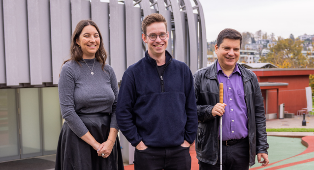
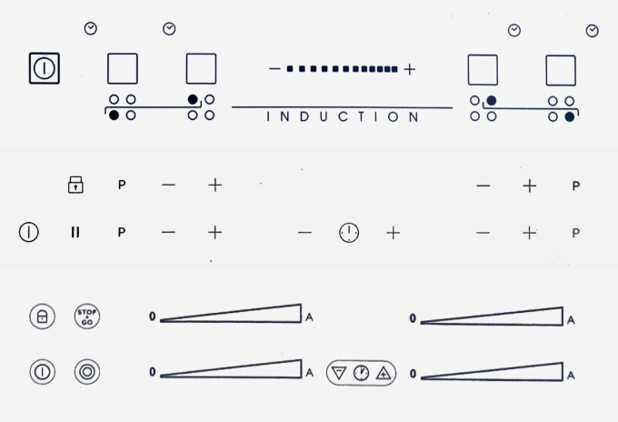
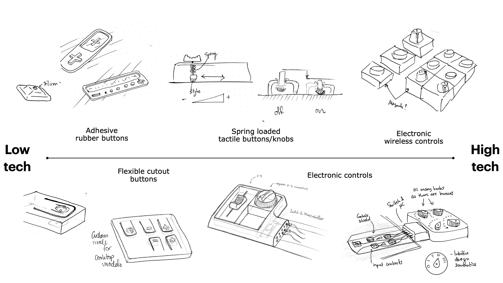
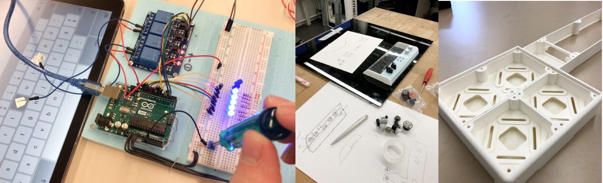
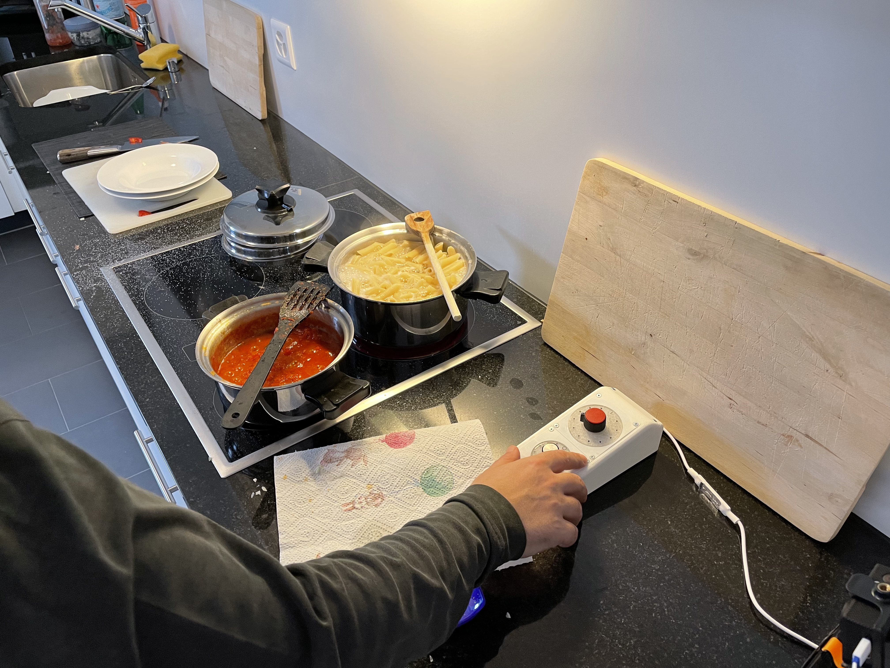

### Video by Innosuisse

<iframe src="https://www.youtube-nocookie.com/embed/_0n_z2QLrWg" frameborder="0" allow="accelerometer; autoplay; clipboard-write; encrypted-media; gyroscope; picture-in-picture; web-share" allowfullscreen></iframe>

### Article
[Innovating in the field of disability through co-creation (innosuisse.ch)](https://www.innosuisse.admin.ch/en/innovating-in-the-field-of-disability-through-co-creation)

---

## Project Details
Industrial Design / concept development of solutions to make modern built-in glass ceramic and induction cooktops usable for users who are visually impaired. Solutions were conceptualized, prototyped, and tested in collaboration with the Swiss Blind Union SBV and HSLU.

### Team
A partnership between HSLU Lucerne University of Applied Sciences and the Swiss Federation for the Blind, funded by the NTN Innovation Booster - Technology & Special Needs, backed by the Swiss Innovation Agency Innosuisse.

The Team started with Luciano Butera (right), Head of Technology and Innovation at the Swiss Blind Federation (SBV) as the industrial partner, me as the project manager and researcher, and Norbert Meier, industrial designer and professor of Industrial Design at Lucerne University of Applied Sciences (HSLU) as the advisor. Once Innosuisse began funding the project, our main contact was Noémi Moulin (left), project coordinator for the NTN Innovation Booster - Technology and Special Needs.

---

### Problem
Many modern cooktops are controlled with a touch-control panel built into the smooth glass surface. These cooktops are typically pre-installed in kitchens of rental units and cannot be removed or replaced. Most do not have an interface for third party devices or control and rely exclusively on touch-controls making them useless to Visually impaired (VI) users. These touch-control cooktops must be retrofitted with a device that takes input from the user via conventional tactile knobs or buttons.

---

### Task
Develop one or several solutions to make existing modern touch-control cooktops accessible for users who are visually impaired.

---

### Development Process

To develop ideas for concepts, the Design Thinking Method was used, including ideation techniques, shadowing and user workshops, and iterative prototyping using rapid prototyping such as 3D printing, lasercutting, and Arduino, testing each iteration with users along the way.

The concepts ranged from very low tech, representing nothing more than a guide for the fingers, to relatively high tech, interfacing directly with the cooktop. Testing was conducted with visually impaired users: ideas were compared, some discarded, some new requirements added.

---

### Results
The final concept consists of an “AutoClicker” module that is controlled wirelessly via low energy bluetooth. The AutoClicker controls leads that are attached to the glass surface with adhesive, one lead per touch button. These leads are recognized by the cooktop control panel just like a real finger. The bluetooth signal comes from a remote module with dials and other basic tactile input elements (switches, sliders, buttons). The user receives feedback via LEDs (90% of visually impaired users can still differentiate light and colors) and/or speakers that emit a short sound corresponding to the current cooktop setting.

---

### Outlook
Throughout the project, we developed several promising prototypes with potential for further refinement. For optimal results, collaboration with a kitchen appliance manufacturer would be beneficial. Their expertise would provide essential insights, market data, and valuable resources.

Our vision isn't limited to supporting only VI users. We're looking at a product that is inclusive for individuals with motor and cognitive challenges, and equally beneficial for the aging population. This endeavor emphasizes the importance of inclusive design, enhancing many lives.

Looking forward, the plan is to advance the project into a second prototyping phase. The ultimate goal is to introduce a versatile product to the market, making a variety of touch-controlled home appliances accessible for all, promoting a shift towards more inclusive design in the industry.
