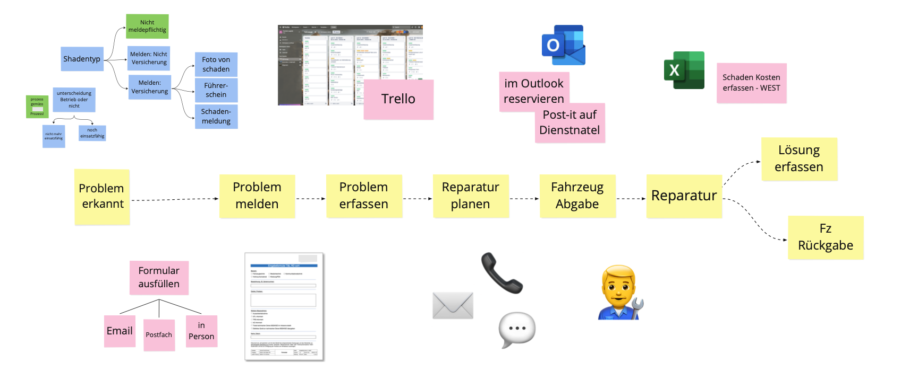
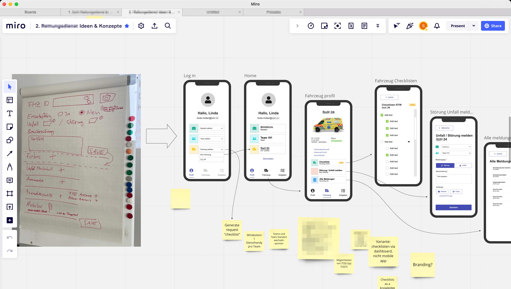
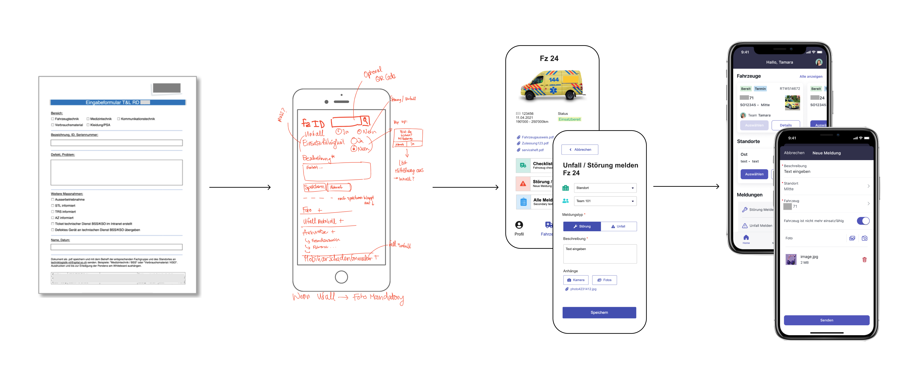
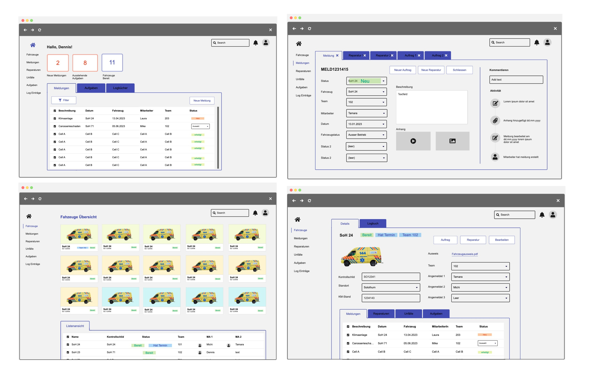

## Problem
Contracted by a Swiss group of hospitals, the challenge was to develop a mobile app and dashboard that would help manage the fleet of ambulances and report and log any damage or repairs.

## Role
I acted as the role of consultant, UX designer, and design workshop facilitator.

## Method
We began by conducting a discovery workshop at the customer's site. They showed us their infrastructure and we explicitly asked us to walk us through every step of their daily routine and processes in order to better understand their pain points. This took several iterations but helped us define a detailed customer journey that laid the foundation for the proposed information architecture and user flow.

The resulting user journey map helped us understand the customer's pain points and design requirements, which allowed us to sketch some initial wireframes, later to be turned into a more functional Figma prototype.

### Example process
One of the problems to be solved with the mobile app was to replace a paper report with tickets submitted through an app. The proposed solution was a virtual workspace for ambulance drivers to submit reports about vehicle faults and repairs, built with ServiceNow's mobile UI design system. We ran several rounds of user tests using the Figma prototype to validate and improve the designs.

## Offer
The project deliverable was a detailed offer to the customer, which proposed a mobile app (shown above), a desktop workspace (below), and a TV screen dashboard.

For budget reasons the offer could not be accepted and the digitalization effort was deferred to a later date.
