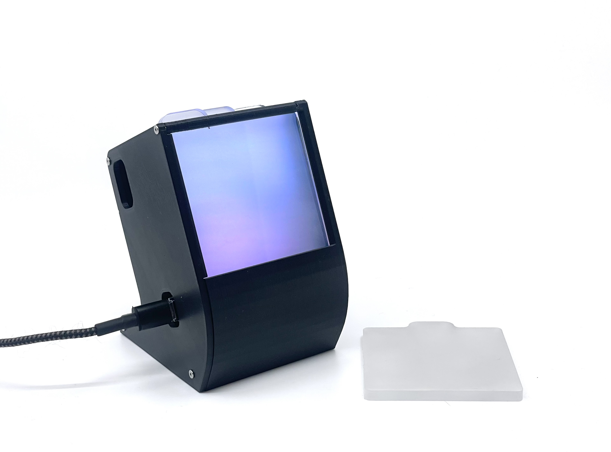

## Idea
A part of a 3 week studio class in the Masters program in Interaction Design, the aim was to explore the of capture and representation of reality through visual means.

I often contemplated the concept of "Resolution". I thought it was interesting that we are converging on this near-perfect resolution representation of both 2D and 3D objects but wanted to question to what extent this is needed. I wanted to investigate whether very low-resolution visuals could have similarly powerful subconscious effects as higher resolution visuals, thus exploring whether the visual resolution was really a relevant factor in convincing us that something is "real".

The idea was to create a "portal to another place via a pixelated camera" (see sketch below), not meant to provide the user with accurate data but simply conveying a vague impression of the other place. If there are people moving on the other side, the idea was to let the user feel this presence, possibly even alleviating feelings of loneliness (even if subconscious).

### Inspiration
I was inspired by artists such as Jim Campell (middle) and design studios such as (now closed) designaffairs (middle bottom). I thought about how we diffuse "real" light, such as with frosted or patterned glass and blinds. These filters intentionally spread light and blur our perception of what's behind them, but for some reason it is still very apparent to us that what's behind them is real. Why is that?

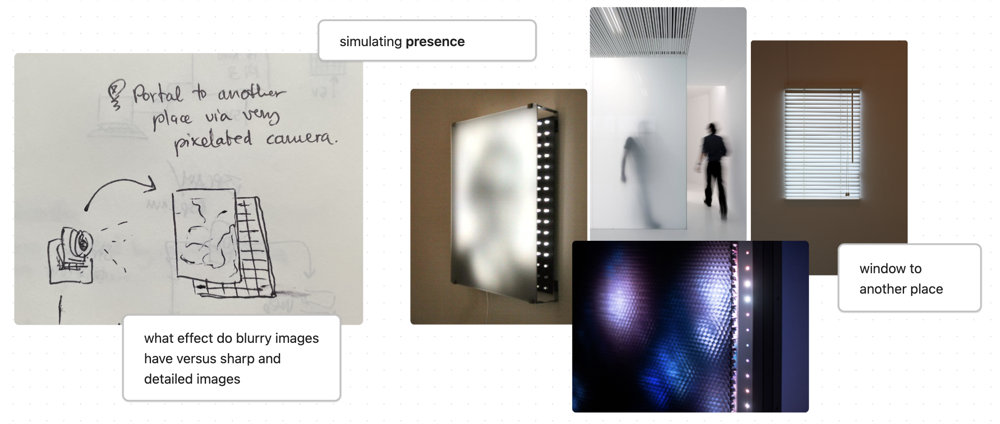

---

## Process
Due to the limited amount of time I intended to use supplies I already had for prototyping.

1. The original idea involved using an ESP32CAM to stream live footage to another ESP32 controlling a 64x64 LED Matrix via the HUB75 interface.
2. I quickly realized that it might be easier to demonstrate using a Raspberry Pi due to its memory and processing capabilities, as I was intending to control quite a large amount of LEDs.
3. I finally decided that demo videos would likely be more effective to convey my message, letting me choose what scene I want to show and being much simpler to implement technically. I also decided to switch to an existing 8x8 LED Matrix that I already had, as its form factor made it easy to transport and I didn't need to build my own grid from one long string of LEDs.

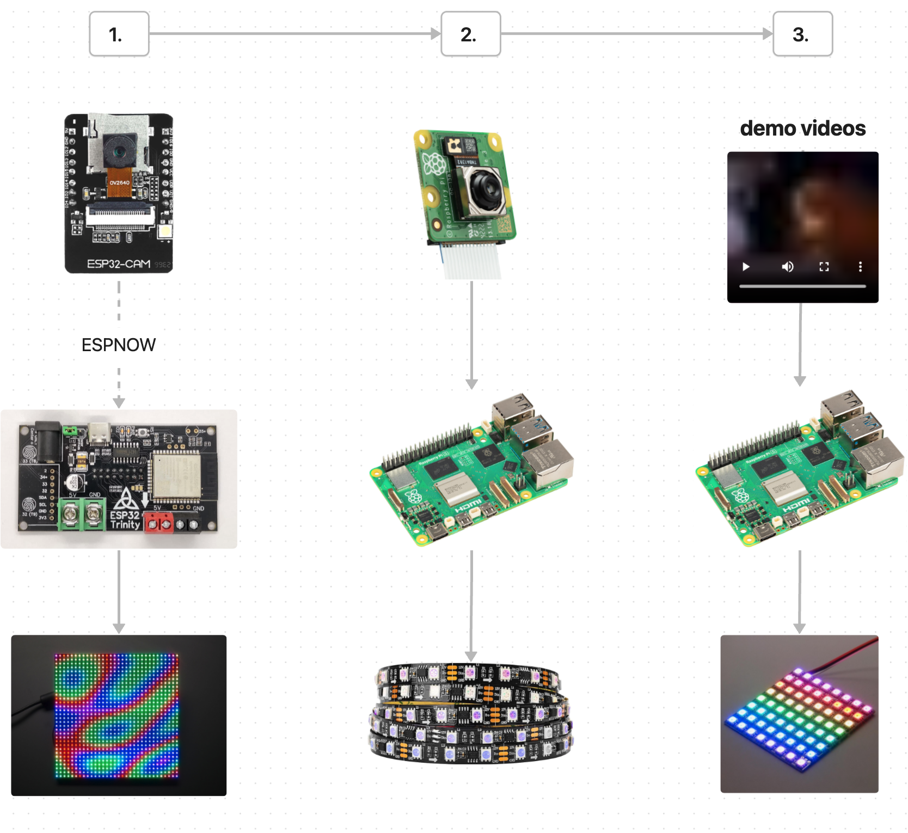

---

## Implementation
I used the following process to display videos on the 8x8 LED Matrix:

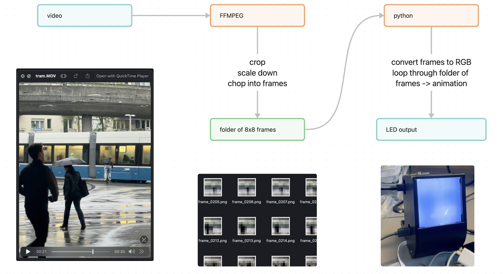

### Videos
As my initial idea was to create a blurry window to another place, I started by taking videos from real life. This process turned out to be surprisingly meditative - I walked around areas in Zürich such as Irchel park, Toni Areal and the Hardbrücke looking for scenes or elements that you would expect to see through a window. Ideally they had to contain high contrast and some organic movement, as my theory was that this movement would be what makes it recognizable later.

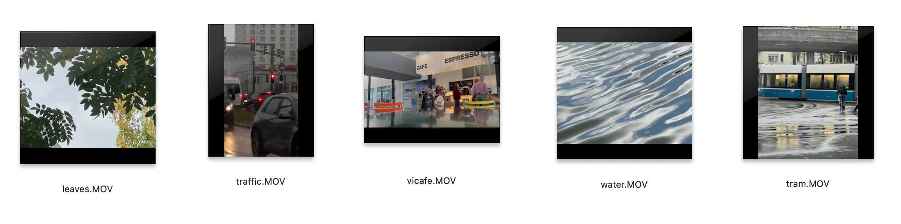

Later I added iconic movie scenes to the collection.

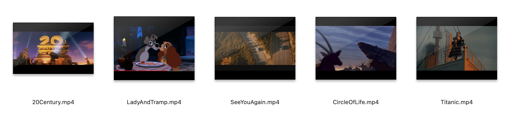

### Code
This script cropped the selected videos to a square format, scaled them down to 8x8 pixels, and extracted pngs of the frames at a defined FPS, saved in a folder called "frames":

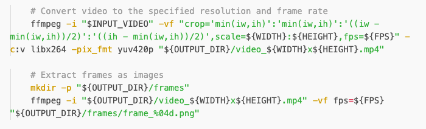

To output videos on the LED matrix, a python script iterates through all the frames in the folder and displays them on the neopixel grid sequentially, making it appear animated.

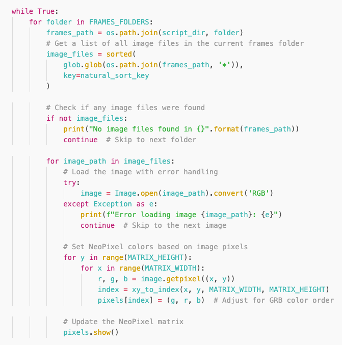

### Hardware
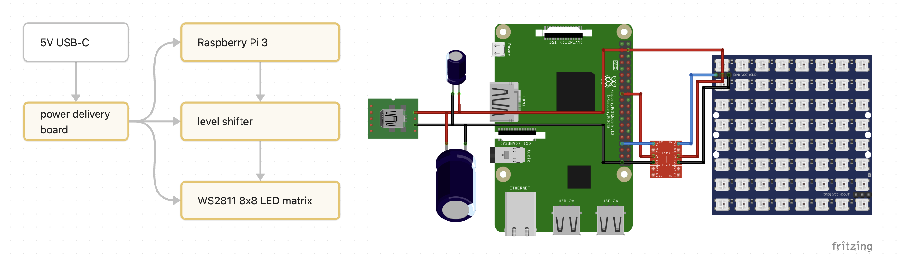

The hardware currently consists of a 8x8 WS2811 LED Matrix connected to a Raspberry Pi 3 via the GPIO 18 and GND pins, powered by 5V from a USB-C power delivery board (allowing it to draw as much current as it might need) and using a level shifter breakout board to convert the Raspberry Pi's 3.3V logic to the 5V logic required by the Neopixels. I developed on the Raspberry Pi in a headless setup using VNC viewer, connected via ethernet.

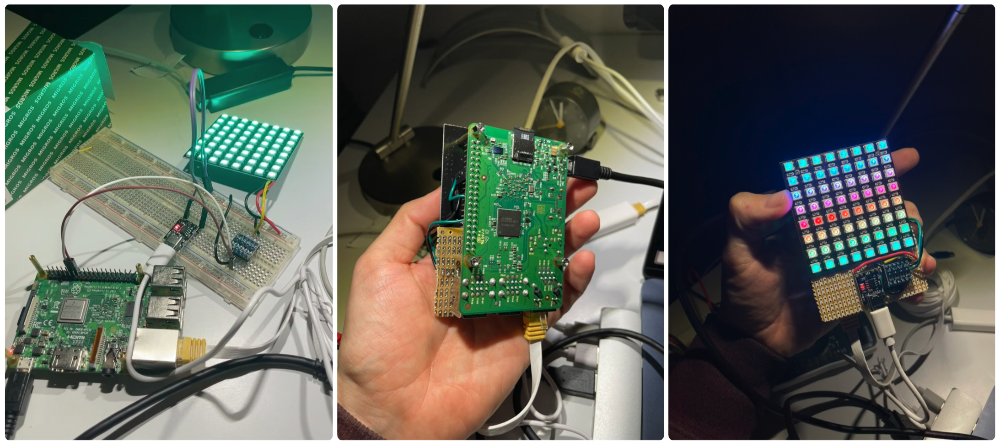

### Light diffusers
Once the electronic setup worked and I was ready to develop the light diffusers. I laser-cut square acrylic panels and sandblasted them to give them the frosted finish. I found that changing the brightness of the LEDs, the distance of a diffuser to the LED panel, the amount of sequential diffusers, and the amount that they were diffusing light all influenced how foggy the image looked. I decided to turn this into a feature of the final result - a slide system that let you change the amount of diffusion by removing or adding diffusion slides to the enclosure holding the Raspberry Pi and LED Matrix.

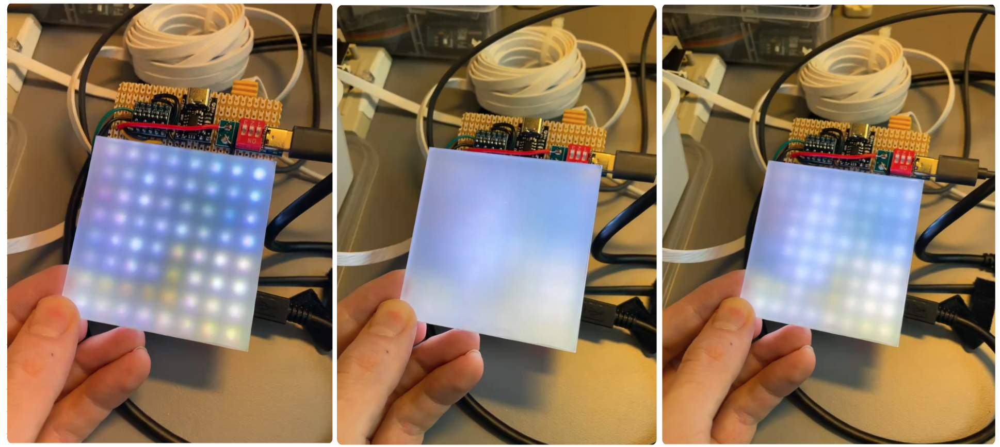

### Enclosure
For this I 3D printed an enclosure, consisting of a base and a lid, connected with M2 screws and threaded inserts. An opening at the top of the LED matrix allows the user to switch out diffuser slides. The enclosure unintentionally ended up looking retro and cute, almost looking like a cartoon snail. I liked this aesthetic, as it felt inviting and matched the playful element of the light diffuser interaction.

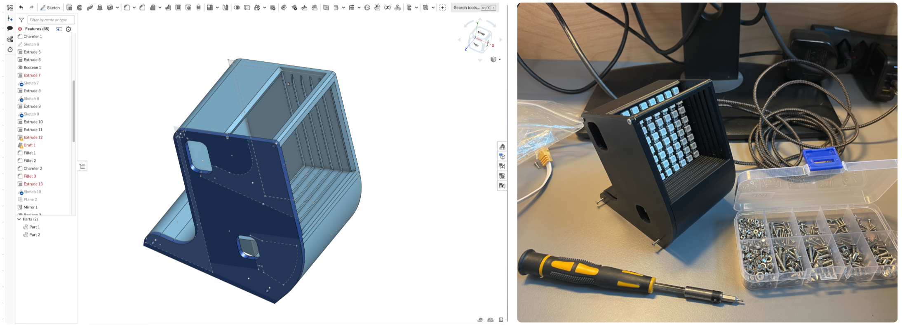

---

## Final product
The final product looks as follows. I powered both the Raspberry Pi and the LED matrix with the same power supply and automated the execution of the python scripts when the Pi is powered on, using a system service file. Once the python script was animating the LEDs, I had four slides with different levels of diffusion that I moved around to show the change in appearance. I played an animation of a public space (example used previously), the *Titanic* bow scene, and short segment of "The Circle of Life" from *The Lion King*.

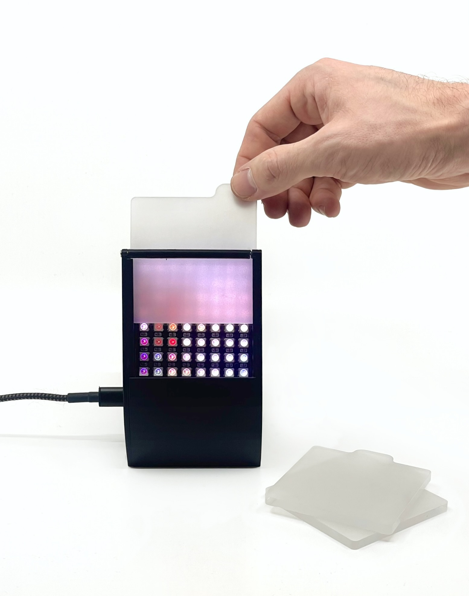

### Limitations and improvements
The current version is limited in a few ways that, in a next version, could be improved as follows:
- Memory of the Raspberry Pi - Use a newer Raspberry Pi or optimize code to pre-load all the image data more efficiently. Consider converting to BMP instead of PNG for more efficient rendering.
- Color accuracy and contrast - implement gamma correction and color correction filters.
- Occasional glitching - Possibly due to fluctuations in current, LED matrix acts erratically sometimes. Other potential causes might be poor connections (I have been using dupont connectors), the quality of the LED matrix, signal noise caused by the level shifter. Using a high quality power brick and cable helps.
