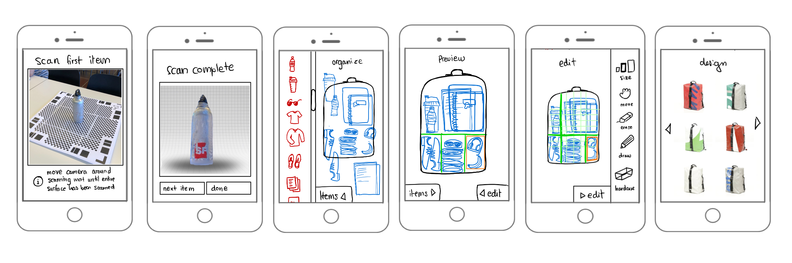
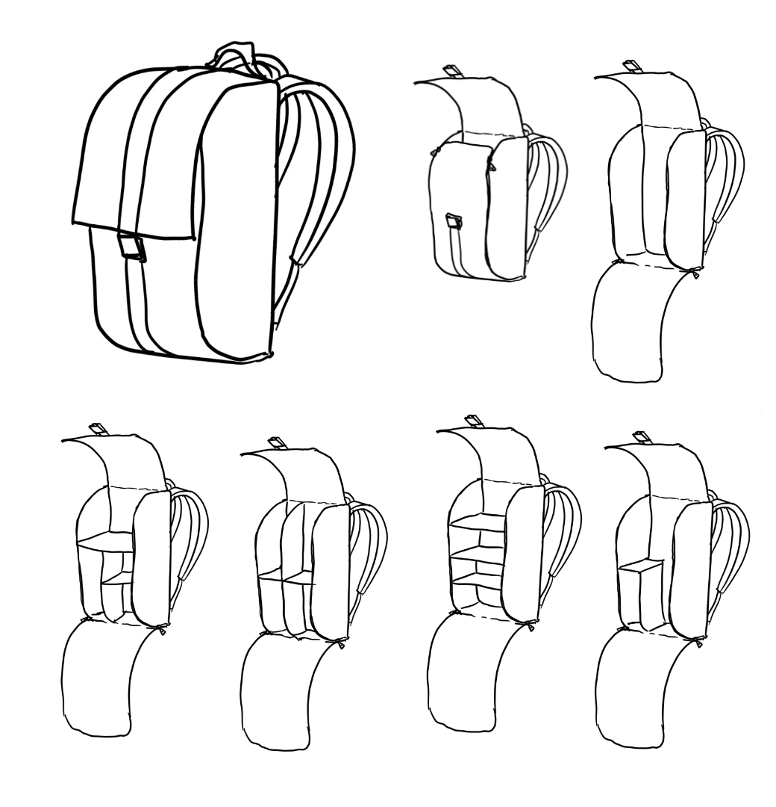
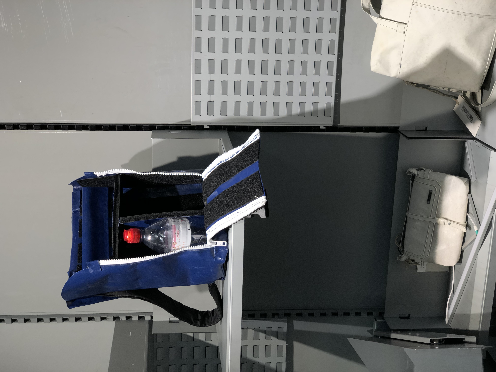

## Problem
Freitag AG, a Swiss company specializing in upcycling materials to create unique bags and accessories, sought inspiration developing new concepts for "individual logistics". The company wanted to explore new ways of delivering their products to customers while maintaining their commitment to sustainability.

Our team of students was tasked with addressing this challenge through a 6-month Design Thinking project. We had to find a way to identify customer needs, develop creative ideas, and prototype potential solutions that aligned with Freitag's brand values.

## Method
We began by conducting extensive user research using personas, interviews, and customer journeys. This allowed us to gain a deep understanding of our target audience's pain points and preferences when it came to product delivery. From there, we used brainstorming techniques to generate a wide range of potential solutions.

Once we had several promising ideas, we created low-fidelity prototypes that we tested with users for feedback. Based on this feedback, we iteratively refined our prototypes until we had a high-fidelity solution that met both user needs and Freitag's sustainability goals. Throughout the process, we also developed a lean business canvas that helped us visualize the potential market for our product.

## Solution
The solution we chose was a bag with modular inserts that could be configured via an app configurator based on a 3D scans of the users belongings that they wished to transport in this bag. We iteratively wireframed how such an app could look and developed a functional prototype of such a bag with inserts so we could demonstrate a few different configurations.

