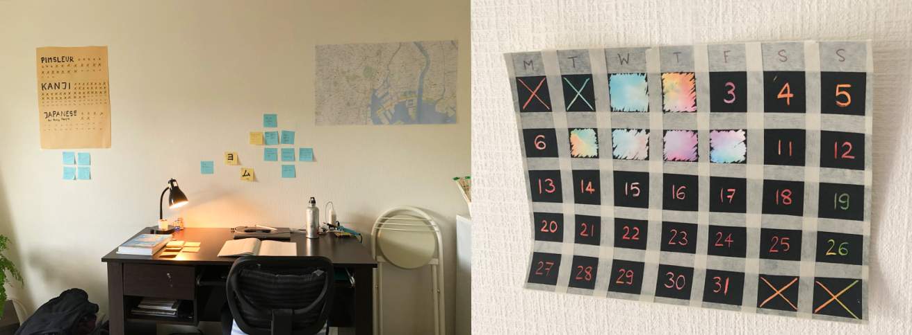
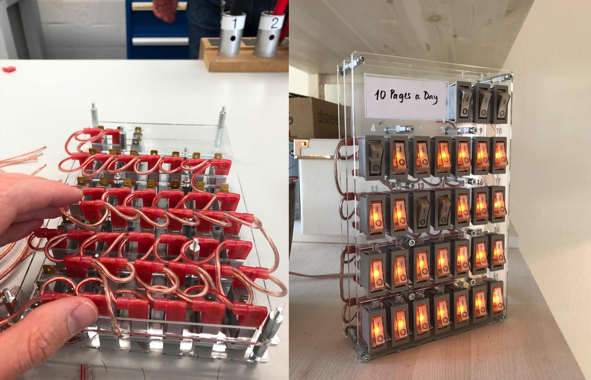
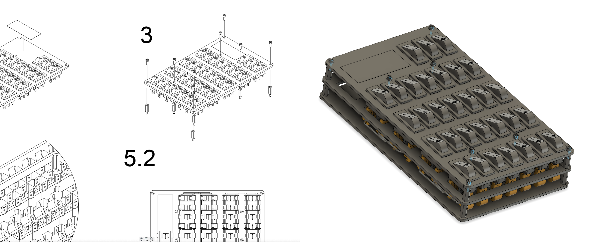
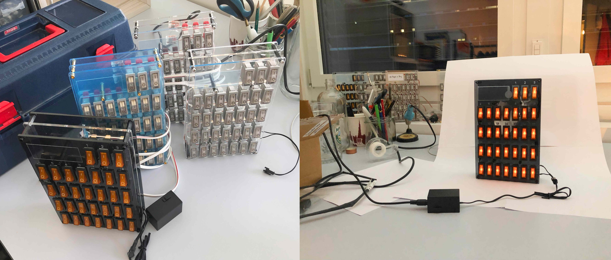
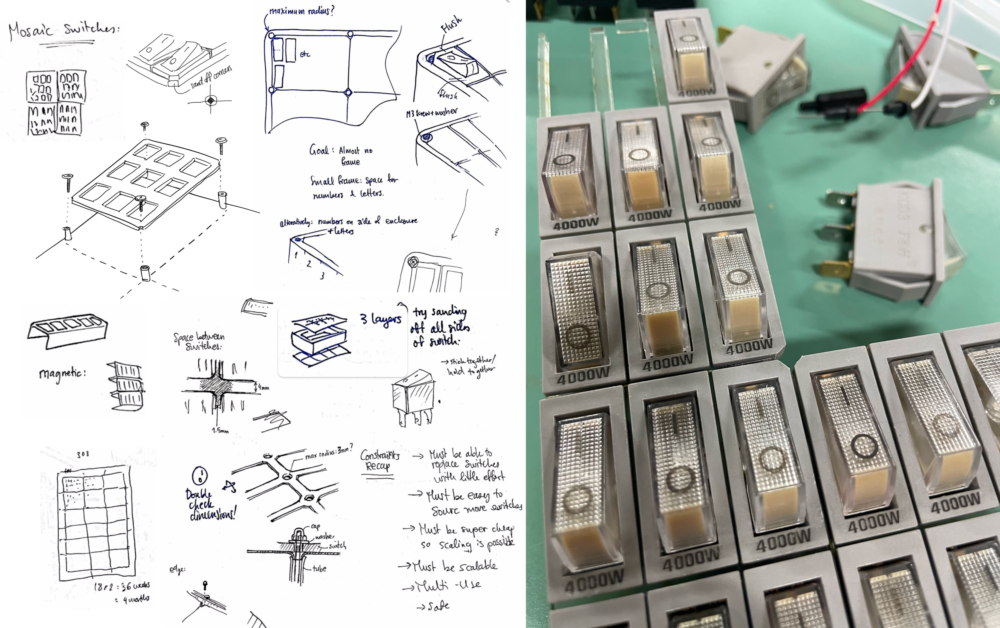
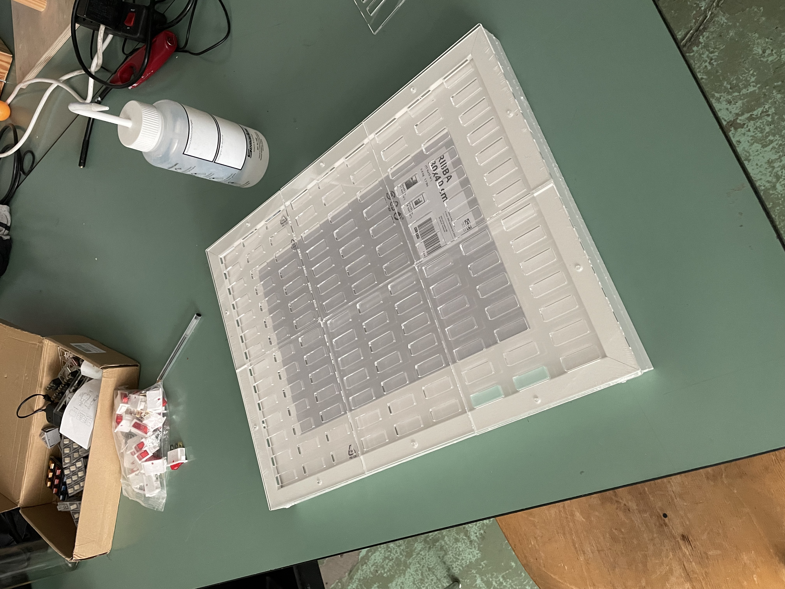

### Inspiration
The idea for GlowGrid was born out of the long and anxious hours of the COVID-19 lockdown. I was stranded in a tiny studio apartment in a Tokyo suburb, having traveled there for an exchange semester but now too scared to leave. Not knowing when or if this lockdown would end but determined to not go insane, I committed myself to a series of new habits (mostly learning japanese, outdoor exercise).

I found the most effective habit tracking tools to be visual reminders that would also show me my progress so far. I started off with posters and later progressed to rainbow scratch paper. I found myself craving that small reward of scratching off another day, and noticing a gap in my progress was just painful enough that I would try to prevent it.

---

## Iteration 1: Acrylic Prototype
Even after lockdown ended, I found myself still using this method to track my habits (now reading books, meditating). I came across Simone Giertz’s "Everyday Calendar", which inspired me to build a more tangible and reusable version of this habit tracking system. The Everyday Calendar uses capacitive touch pads that light up when touched.

Preferring the idea of a more tactile experience, my first prototype consisted of an acrylic frame with an array of 31 illuminated neon rocker switches - one switch for each day.

The idea worked well. I refined the design in CAD and improved the wiring to make it easier to assemble and repair. With the second version I had a product that was easy and safe enough to produce serially. I made 6 units in various colors for friends.

---

## Iteration 2: A Broader Canvas
Encouraged by [Valentin Ruhry's "Hello World"](http://ruhry.at/en/work/items/untitled-hello-world.html), I have expanded GlowGrid's scope.

The next version of GlowGrid aims to be much larger than 31 switches – hopefully hundreds or thousands. Date labels will be omitted, the aim shifted towards a broader view of achievement: recognizing that progress isn’t always linear. The illuminated switches should appear like pixels, capturing the essence that every small effort contributes to the bigger picture.

The current challenges are sourcing a more appropriate and affordable rocker switch and reducing the spacing between the switches, possibly transitioning from the current acrylic frame to a stronger version made of aluminum or steel. The acrylic frame pictured above will be used to prototype the electric wiring and validate the modular design idea.

