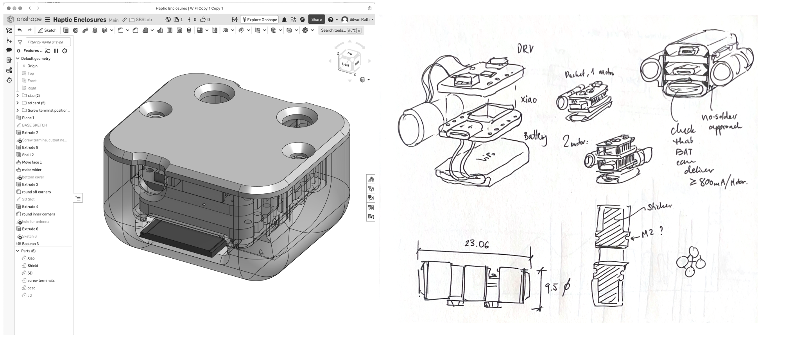
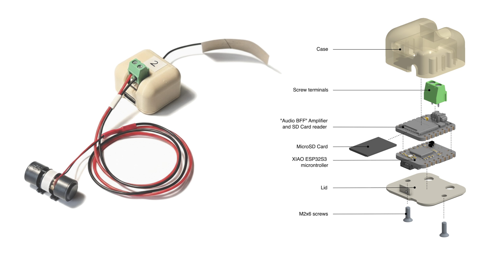
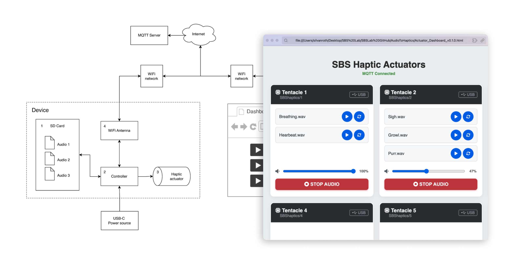

### Task
Contracted by one of ETH Zürich's neuroscience research labs, it was my job to produce a piece of hardware that would be capable of converting any audio files into vibration patterns. The project belonged to a larger effort to understand and systematize how we as humans perceive tactile feedback and haptic interactions with robots. Which haptic patterns do we consider pleasant, and which do we feel an aversion to?

### Solution
The Audio-to-haptics solution relies on cheap, widely available components and a working principle that is intuitive and well-documented. It uses a microcontroller with a wifi antenna, an audio amplifier, and an SD card reader. 

An SD card pre-loaded with audio files is inserted into the device. The device is powered via USB C (eg. with a power bank). The haptic vibration motor is plugged into the device, and can now be embedded into the object of study. The device and the contents of its SD card can then be seen on an online dashboard, where the user can play, loop, and stop each audio file as needed. The device amplifies the audio signal so that the vibration motor outputs them as vibrations.

### Role
I was responsible for the complete design, prototyping, documentation and shipping of this product. The solution was to be as robust as possible, with multiple backup options in place so the device could stay in operation for the duration of the studies it was intended to be used for. The intended user was also considered non-technical, which provided me with the additional challenge of documenting without the use of technical jargon. Overall, a rewarding experience in transdisciplinary product development and exchange.

