## Idea
Developing an interactive grid of buttons that light up and change colors when pressed, designed to communicate, connect, and create art across distances. Each grid is connected via the internet to a corresponding grid, allowing users to share visual messages in real-time.

This project explores the fusion of technology and creativity, aiming to understand how we interact with digital interfaces on a personal and communal level.

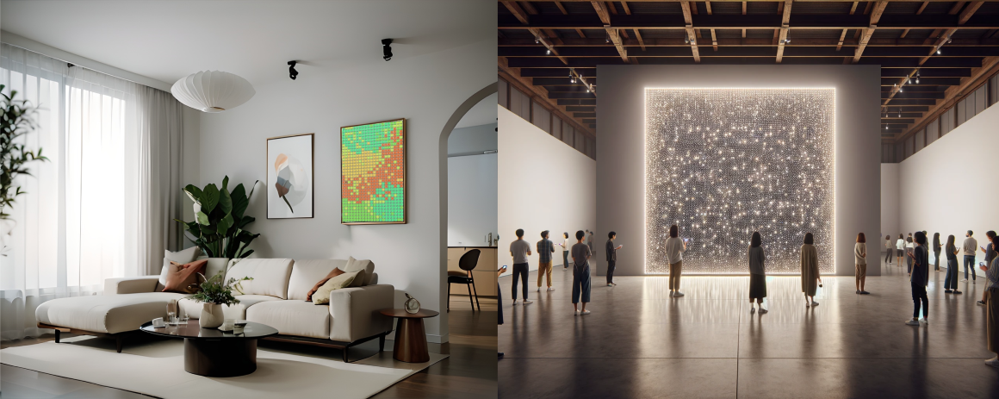
*Renders generated using photoshop and AI tools illustrating two possible scales of this project*

## Inspiration
The main sources of inspiration for this project stemmed from the following:
- The reddit project r/place, a digital online canvas allowing the entire online community to collectively create pixel art.
- Valentin Ruhry’s and Simone Giertz’s grids of illuminated switches.
- “The Everbright”, an installation seen at the San Jose Science Museum in 2021.

Andy developed a physical version of r/place in 2023 with [GridWorld](https://andykong.org/projects/gridworld/), a virtual canvas that was displayed in real time on a physical LED screen. My own ideas came from previous projects such as [GlowGrid](/p/6852) and my work in tactile user interfaces.

---

## Use cases by configuration
The following are some of the potential use cases for this project. We have not yet attempted to evaluate the feasibility of each of the ideas to narrow down the scope of the project, as we believe users will find their own unique and creative uses for the product once they are given access.

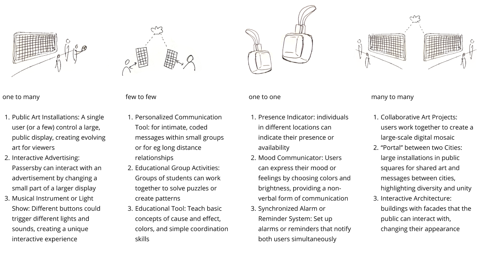

---

## Design
The design process of Interactiles started in December 2023. We made sure to respect certain basic principles, such as modularity, no screen, and exclusively tactile controls. The buttons were to feel pleasant and as tactile as possible. The use case was not clear yet at this point, but we were determined that a clean and user friendly product would find its use case if it was designed to be user friendly enough.

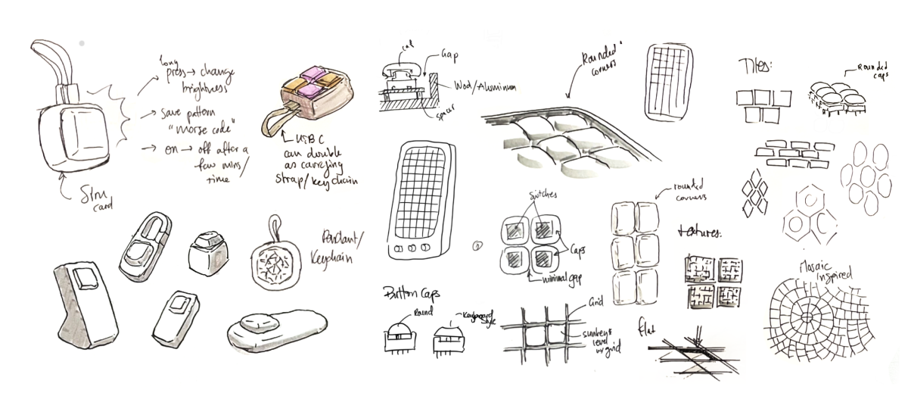
*Sketches of initial ideas for different form factors*

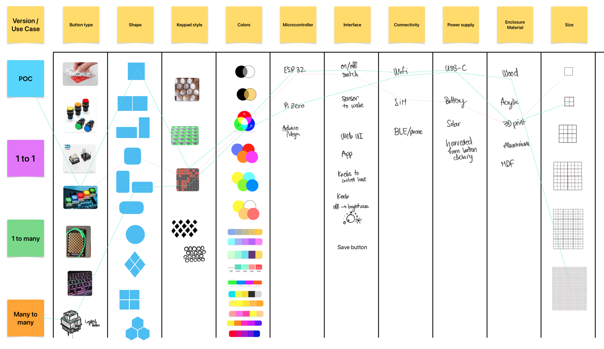
*Morphological box used to make sense of all the possible designs that could be pursued*

### Iteration 1
A first iteration was designed using non-intelligent tactile RGB Switches and an ESP32 microcontroller.

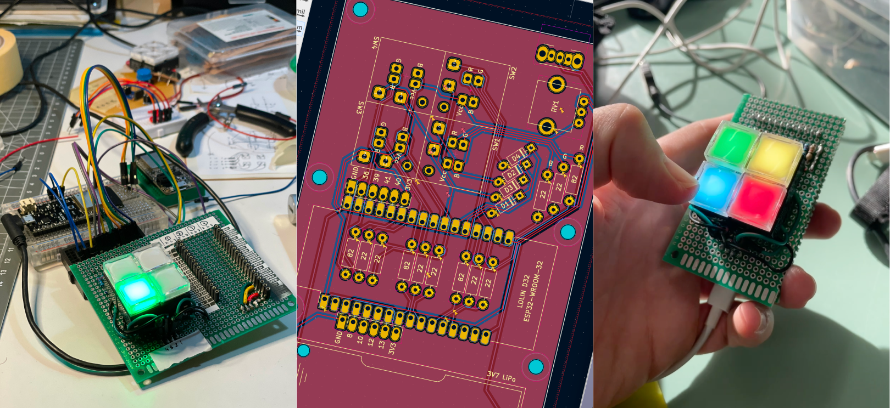
*ESP32 prototyping with non-intelligent, standard tactile RBG switches.*

### Iteration 2
The second iteration used the same RGB switches but a smaller microcontroller and ICs to control the RGB channels, rather than addressing each color individually. This model is fully compatible with the original prototype. Four fully functional 2x2 Interactiles are currently assembled.

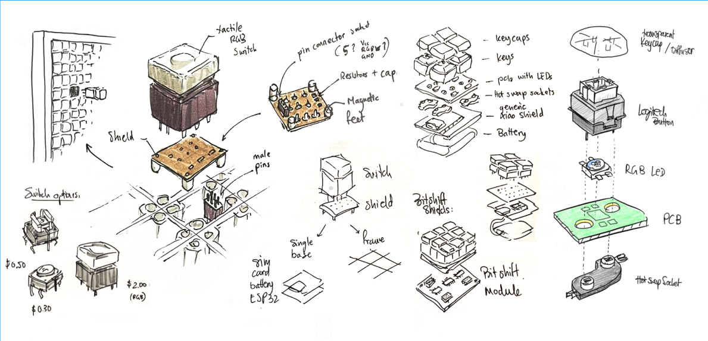
*Modular setup sketches (left-center left) and a setup using keyboard keys and intelligent RGB LEDs.*

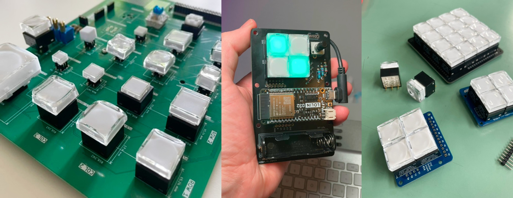
*Prototyping with different sizes and types of tactile switch. PCB Design with KiCAD, manufactured through JLCPCB.*

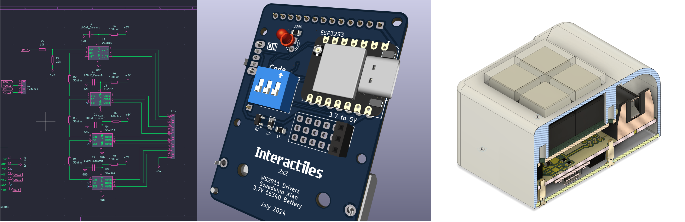
*From schematic to enclosure design for the second iteration of the 2x2 Interactiles.*

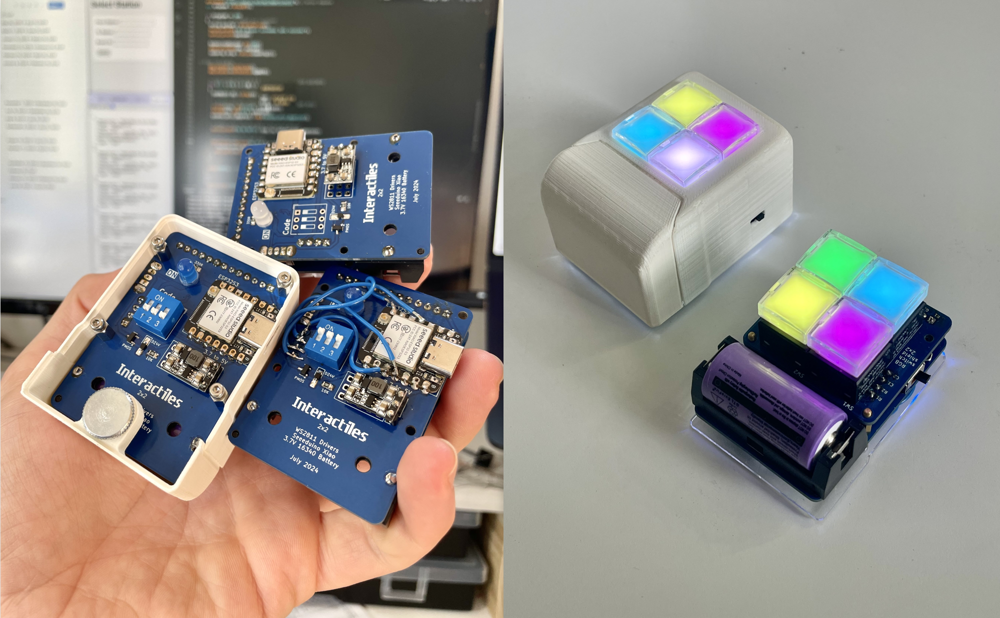
*Completed 2x2 Interactiles PCBs, with and without 3D printed enclosures. A dip switch on the back of the PCB was added to allow users to select their "channel" - with the idea that all Interactiles on the same channel would display the same colors.*

### Networking
Interactiles is a project about enabling connection, so a key feature must be that they can interface with each other. I started with a HTTP web server and an webpage to emulate a second Interactile while I iterated on the firmware. Once this was stable, I switched to a more efficient MQTT structure, in which each individual pixel is subscribed to or posts to a channel containing an RGB value. Like this, pressing a button to change the color of the pixel will post the change on the MQTT server, which will be read by any corresponding subscribed pixels. This happens quickly enough that it appears that all pixels are changing perfectly in sync.

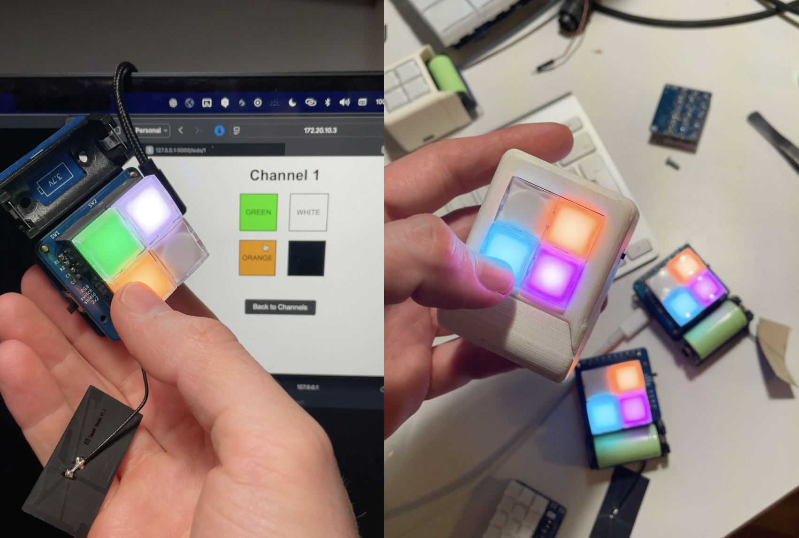

### Scaling up (WIP since Sept 2024)
The next step is to build a bigger grid of pixels. I am currently working on designing one 10x6 matrix using the largest available switches and one miniaturized version of the same matrix size using the smallest available buttons.

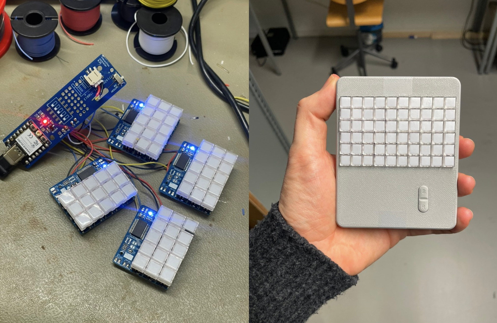

