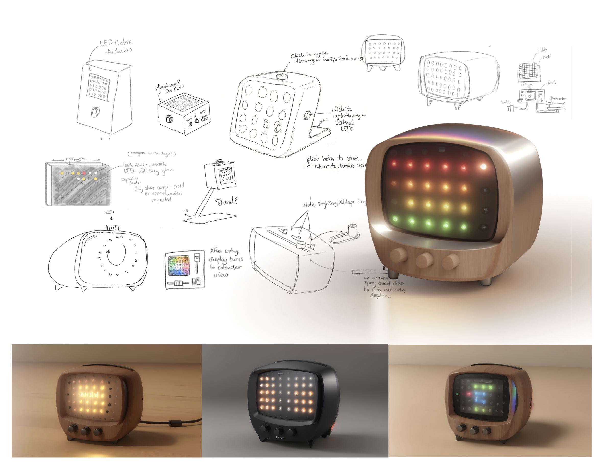
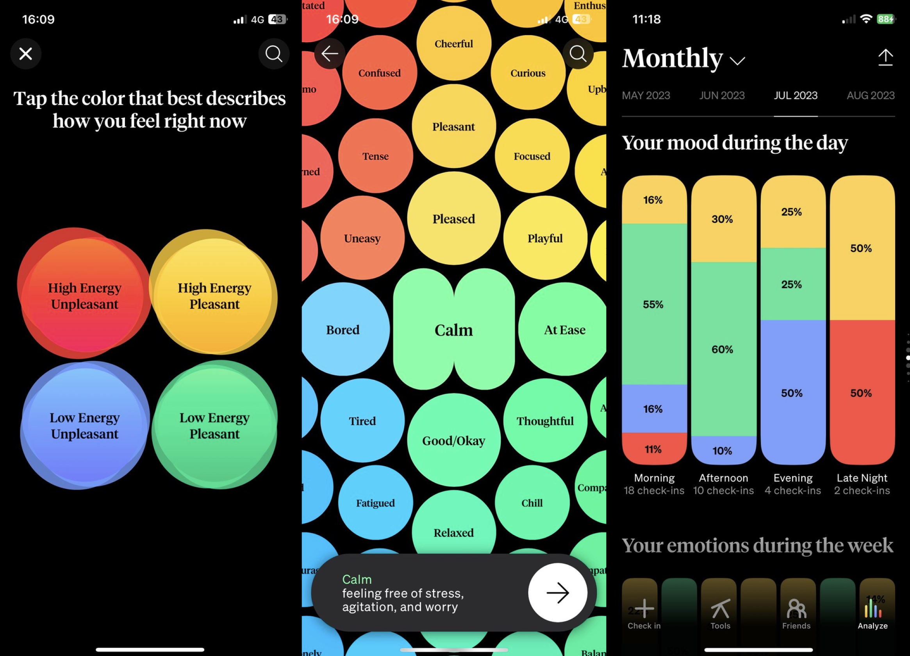
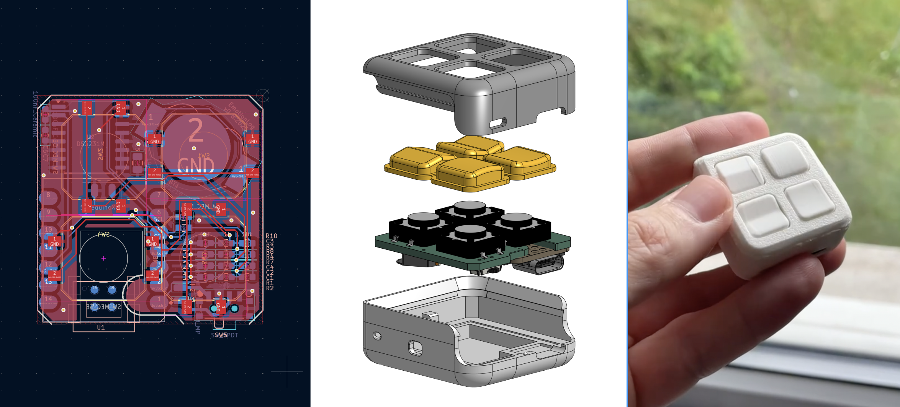

### The Challenge of Mood Tracking
I aimed to create a more reliable way to track mood over time, recognizing that understanding the patterns and triggers behind emotional shifts is a crucial first step toward better self-regulation. My initial thought was to design an ambient "companion device" that would use colored lights to visualize mood. I believed this would be a calming and grounding presence.

However, I quickly realized a critical flaw: such a device could have the negative effect of constantly reminding users of their bad moods, which is counterproductive for many who struggle with anxiety or depression.

## Mood tracking apps
In order to capture a wider timeline of emotions, not just those occurring while around the physical device, I explored mood-tracking apps. A common issue I noticed was that most relied on a one-dimensional "Bad-to-Good" scale, which I found inaccurate. The *How We Feel* app, which organizes emotions based on the two dimensions of **valence** (pleasantness) and **arousal** (energy), offered a much more accurate model.

While this was app was surprisingly effective for building emotional vocabulary, it led to a new problem: I became an expert at describing negative states but rarely remembered to log positive ones. The act of sifting through negative terms to find the right one often led to a feedback loop that often deepened my negative mood.

---

### Mood tracking fidget cube
Prompted by a therapist's suggestion, I decided to simplify the process by logging emotions into the four quadrants of valence and arousal. I designed a new prototype: a tactile, fidget cube-like device for simple, non-invasive input. The act of fidgeting can be a subconscious activity, which theoretically limits the negative feedback loop I experienced with most of the apps.

The prototype features four tactile buttons, each with a unique texture corresponding to one of the four quadrants. I designed the electronics and 3D-printed the enclosure and various tactile button caps. The internal hardware includes an ESP32S3 microcontroller, a real-time clock, and a small battery.

Every button press is logged with a timestamp into a CSV file, which can be extracted via Wi-Fi or USB. This data can then be easily plotted against other metrics, such as health data or calendar events, to reveal meaningful patterns.

---

### Future Development
The next steps for this project involve developing the firmware to ensure a seamless and user-centric experience. I'm also planning to design a magnetic docking station to simplify charging and data transmission. In parallel, I will start collecting data by logging my own moods using this device.

