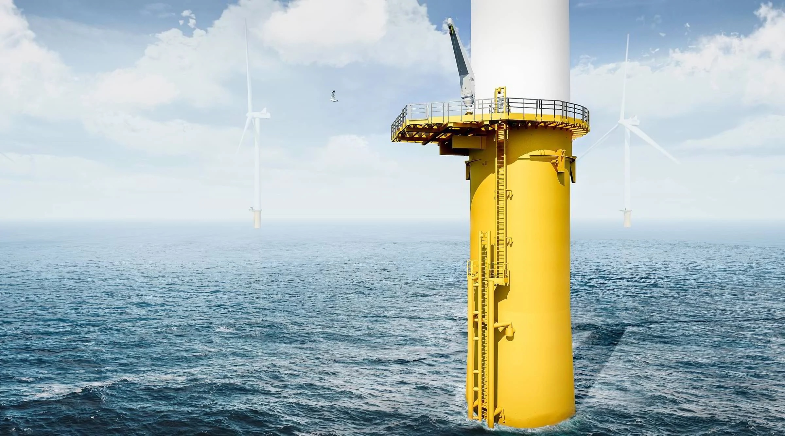
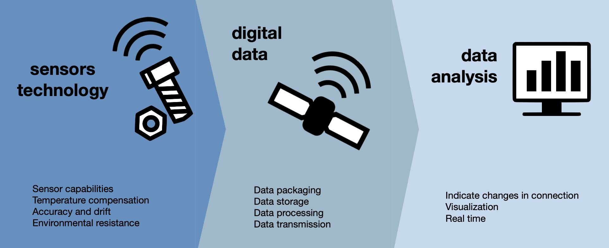
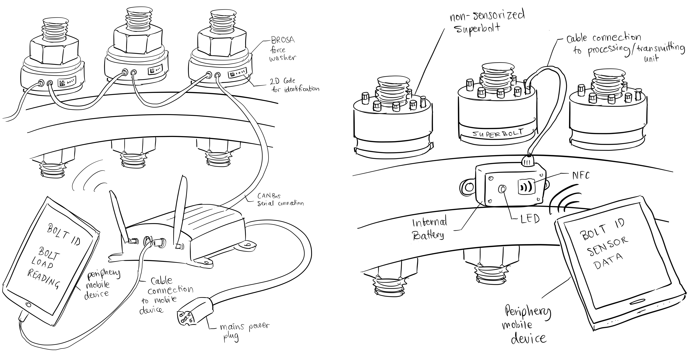

### Problem Statement
The dynamics and vibrations experienced by Offshore Wind Turbine (OWTs) bolted joints, especially monopile - transition piece (MP- TP) flanges, can jeopardize joint reliability. Challenges include bolt relaxation, fatigue, and corrosion. Notably, these connections are typically inspected on a fixed schedule rather than in real-time. Previously, field operatives noticed loosened bolts in MP-TP connections, but the precise cause was unidentified.

---

### Project Aim
To conceptualize a monitoring system for bolted flange connections and to determine its feasibility in terms of cost savings during Operation and Maintenance (O&M).

---

### Approach
- Utilize existing technologies to monitor bolted flange connection conditions.
- Convert these measurements into digital data.
- Transmit this data in real-time to an onshore location for interpretation and visualization.

---

## Impact
> The project's proposed innovation pushes the industry from fixed-schedule maintenance to condition-based maintenance, presenting potential significant long-term savings in OWF maintenance.

Long-Term Benefits:
- *Reduced Inspection Frequency:* This leads to significant savings on maintenance trips.
- *Minimized Inspection Extent:* Focus only on areas of concern.
- *Enhanced Structural Integrity Confidence*: Reduced uncertainty in the overall structural health.
- *Mitigated Unplanned Maintenance:* By catching issues earlier.
- *Bolt Failure Root Causes*: Identification of primary reasons for bolt failures.
- *Regulation & Standardization Contribution*: Set new industry benchmarks and standards.
- *New Opportunities*: Pave the way for advancements in structural engineering and innovative product development.

---

### Executive Summary
As offshore wind energy gains traction, most offshore wind turbines consist of a monopile and a transition piece secured by flanges and M72 steel bolts. Arvick BV, specialists in the bolting methodologies for these connections, aspires to extend their expertise to condition monitoring. This initiative offers wind park operators or owners the ability to oversee their assets' bolted flange connections throughout its 20-30 year lifespan, ensuring superior asset integrity.

The project's ambition is to conceptualize this monitoring system, commencing with a preliminary situation analysis. This process establishes the groundwork for distinct system requirements which emphasize measuring bolt loads, ensuring compatibility with hydraulic bolting instruments, efficient data processing, and secure onshore data transmission.

Various technological solutions were evaluated, culminating in three primary concepts:
1. A versatile system harnessing NordLock Superbolt smart tensioners.
2. A technologically advanced setup utilizing Brosa Force Washers via CANBus.
3. A cost-conscious system employing wireless Sulzer Sense accelerometers for vibration-rooted detection.

---

## My Role
- **Product Planning:** Spearheaded the early phases, aligning problem with product vision.
- **Concept Development:** Led brainstorming and visualization sessions.
- **Requirement Engineering:** Developed the table of requirements, applied a morphological box approach, and illustrated these concepts through detailed diagrams and sketches.
