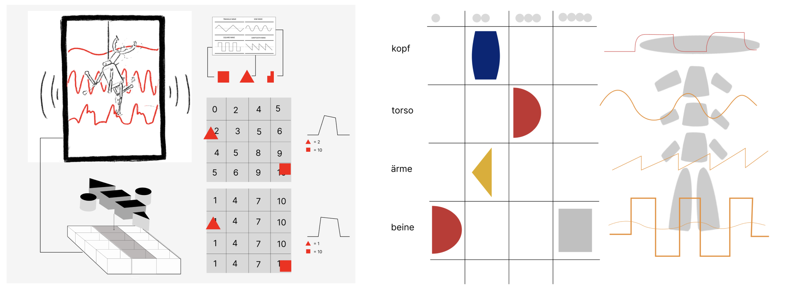
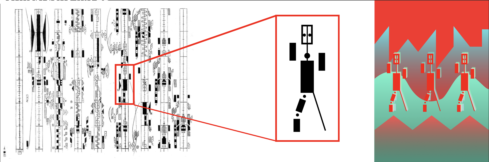
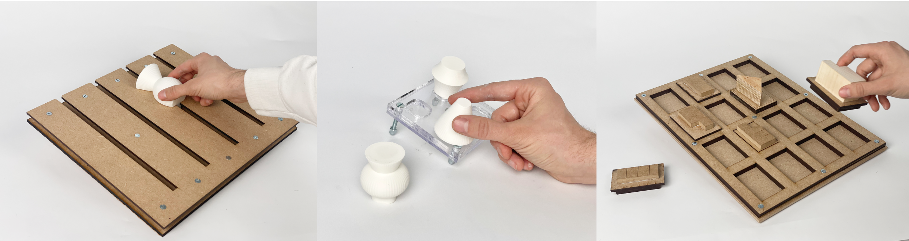
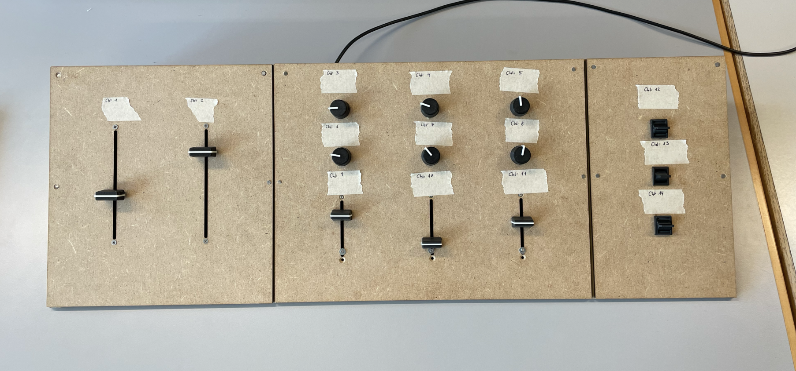
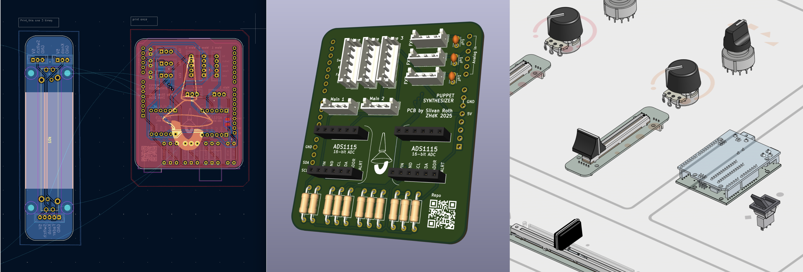
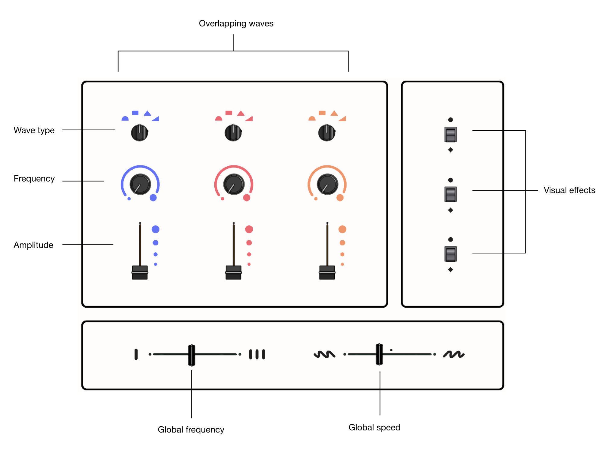
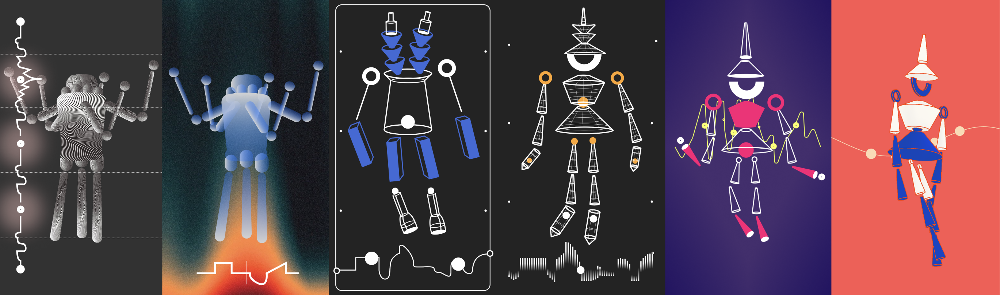
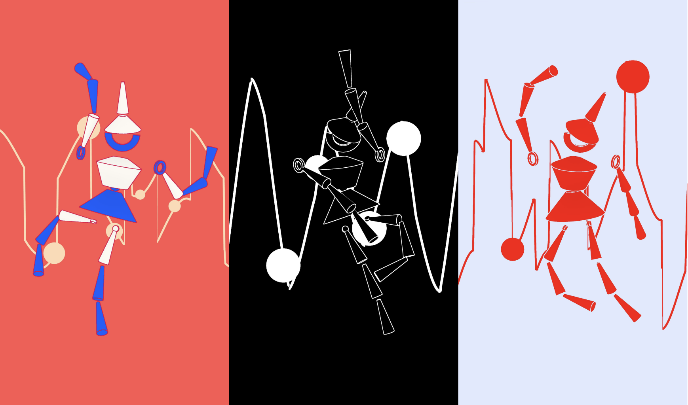
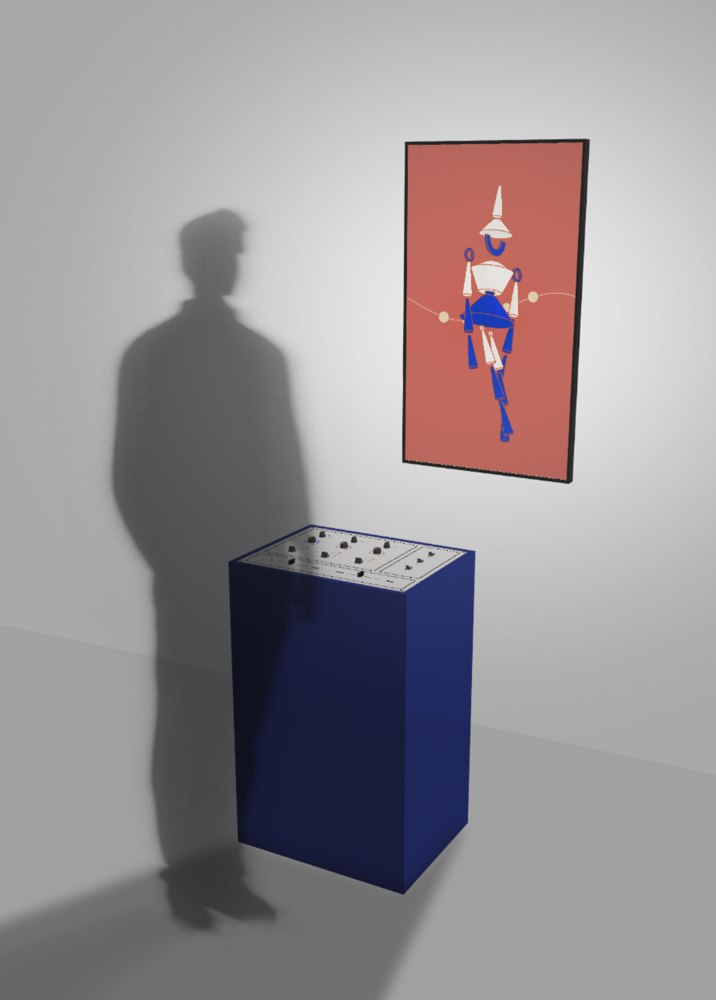
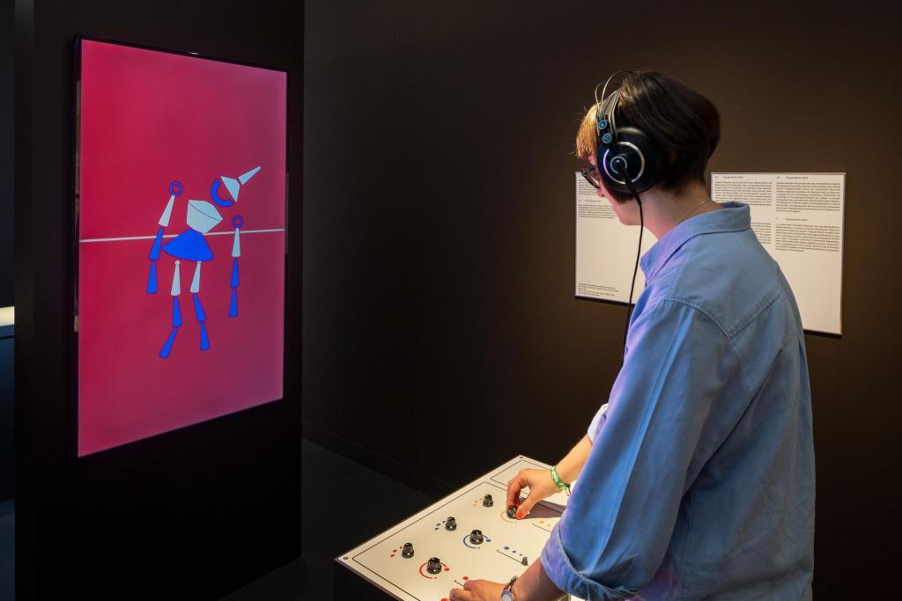

For the Exhibition ["Museum of the Future"](https://museum-gestaltung.ch/de/ausstellung/museum-future) in the fall of 2025, Zürich's Museum für Gestaltung commissioned ZHdK to develop a series of interactive installations paying tribute to Sophie Täuber Arp's infamous wooden marionettes that she created for the play *King Stag*.

[Repository](https://github.com/sullyjason/PuppetSynthesizer)

## Concept
Puppet Synth is a digital reinterpretation of Sophie Taeuber-Arp’s avant-garde puppetry for King Stag, breaking with traditional visual and performative conventions. Inspired by Rudolf Laban’s choreographic notation and Taeuber-Arp’s expressive dance practice, this project brings the puppets’ gestures into the digital realm. Users are invited to choreograph puppet movements themselves. Visually, Puppet Synth renders these complex motion sequences as wave-like frequency patterns, making them both tangible and analyzable.

## Team
The team consists of five members coming from various disciplines.
- Lisa Bach - Unity 3D and creative direction
- Silvan Roth - Interface design and hardware
- Jan Hügli - Prototyping and production
- Jan Thürig - Unity 3D and firmware
- Jan Espig - Visual design
- David Bock & Lars Kristian - Sound design

## Ideation
The original idea revolved around animating a marionette by controlling a series of waves or frequencies through an experimental and highly tactile interface.

We were inspired by the revolved wooden shapes that make up Sophie Täuber-Arp's marionettes and the Labanotation, a system for analyzing and recording human movement such as dance.

## Prototyping
Developing the concept involved a few iterations of physical prototyping and experimentation in Unity 3D. The aim was to develop an interaction that would spark curiosity in the user, encouraging them to rearrange physical blocks that would then have an effect on the animation.

To test these conceptual interactions we experimented with various arduino compatible sensors, linear potentiometers, 3D printed caps and joysticks.

In later iterations we limited the possible inputs to a few dimensions. The interface gradually took on the style of an audio synthesizer.

## Implementation

### Interface
The interface consists of 5 types of inputs: rotary switches, smooth rotary potentiometers, linear potentiometers (faders), and momentary 3 position toggle switches.

The final version was designed in KiCad and exported into OnShape for the final panel dimensions.

The panel was designed to not be overly explicit in its functionality but still give users a sense of control, so the various actions can be learned over time. The layout guides the user through the interaction in a logical sequence, and the knobs were chosen with their affordances in mind, creating a cohesive experience with what is happening on screen.

### Visual Style
We went through a series of iterations before settling on a visual style for both the marionette and the wave visualization.

The final visual style takes inspiration from Sophie Täuber-Arp's minimal color palette and simple revolved shapes that make up the marionettes.

## Experience
The audience stands in front of the physical interface facing a vertically oriented screen, where a puppet is seen dangling in front of a slow sine wave. As the interface is operated, the wave and audio changes and the puppet jumps to life.

## Installation
The installation is currently being exhibited at the [Design Museum in Zürich](https://museum-gestaltung.ch/de/ausstellung/museum-future) as a part of the theme "Museum of the Future". The exhibition aims to use digital means to make accessible to the audience cultural artifacts that are otherwise difficult or impossible to experience – because they are long gone, do not yet exist, are too large or too small, or would be too fragile for the public to interact with.

*Photo: Museum für Gestaltung Zürich*
