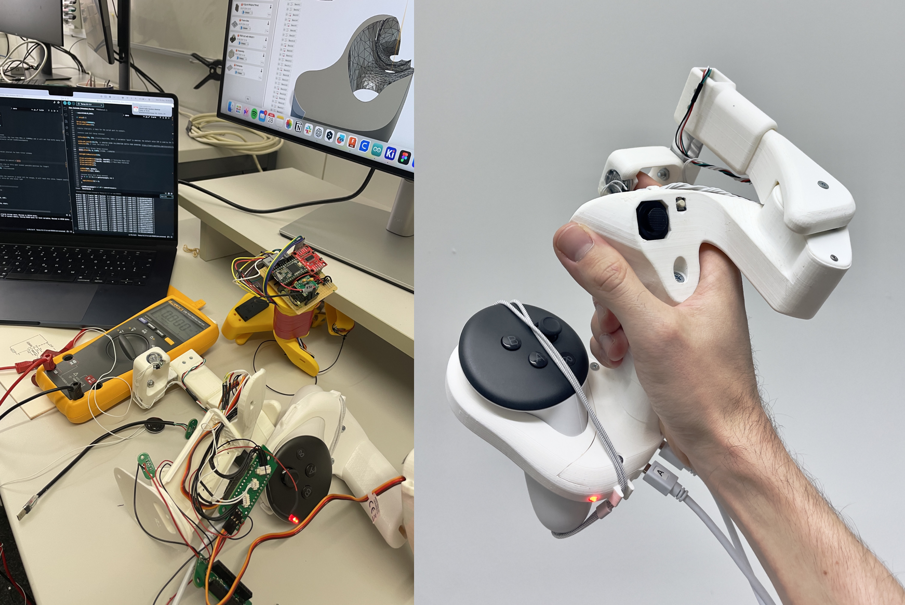
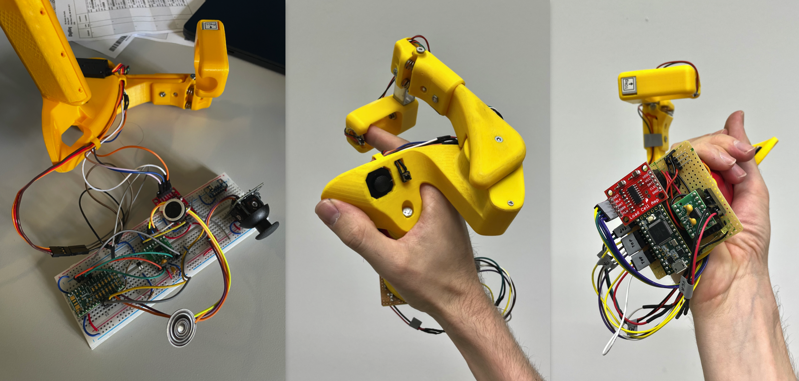
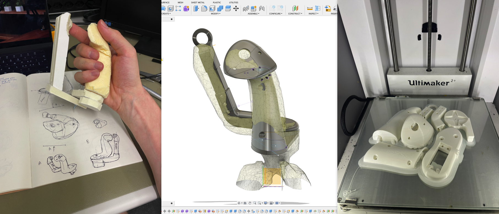
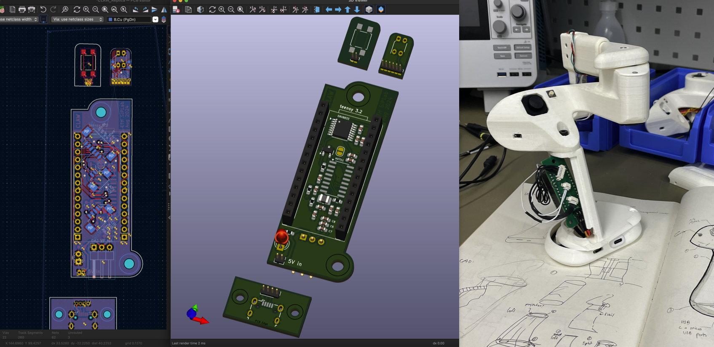
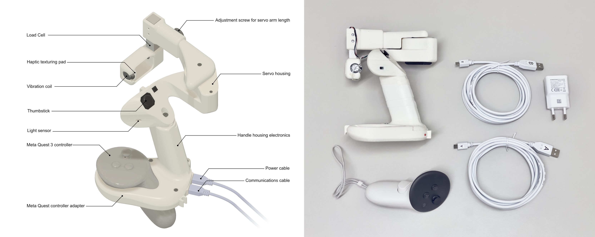

## Task
To rebuild the original CLAW Controller, a haptic VR controller with force simulation, designed by Inrak Choi at Microsoft Research in 2018.

"CLAW is a handheld virtual reality controller that augments the typical controller functionality with force feedback and actuated movement to the index finger. Our controller enables three distinct interactions...and changes its corresponding haptic rendering by sensing the differences in the user’s grasp" (Choi et al, 2018)

### Role
- Prototyping
- PCB Design
- Industrial design
- Firmware
- Documentation

---

## Process

### Version 1
The first iteration of the rebuilding the controller according to the original documentation provided in the paper.

### Version 1.1
Between the first and final version there was an attempt to rebuild the controller from the ground up, optimizing the ergonomics and industrial design by moving the servo arm downward.

I tested the form with foam and cardboard, then 3D scanned and imported this into CAD, where a built a parametric model for 3D printing.

Due to time constraints we decided to focus on improving the electronics and code rather than the industrial design, and this version of the controller was shelved.

---

### Version 2
The second iteration of the controller was a slimmed down, more compact version based on the original designs. I designed a PCB to hold the microcontroller, the load cell amplifier, and the vibration motor driver circuitry.

Some components from the servo arm were improved and I designed a custom Meta Quest 3 controller adapter which could be used for more accurate hand tracking, if needed.

The controller's firmware was written entirely in Arduino C, using the serial monitor as the interface to read sensors and send commands. A Unity build can then talk to the controller to allow the user to control and interact with their virtual reality environment.

### Revision
Testing showed a few mechanical failure points, which led us to fabricate one final version. We took this opportunity to revise the PCB and polish the appearance. The parts were SLA printed in black nylon.

