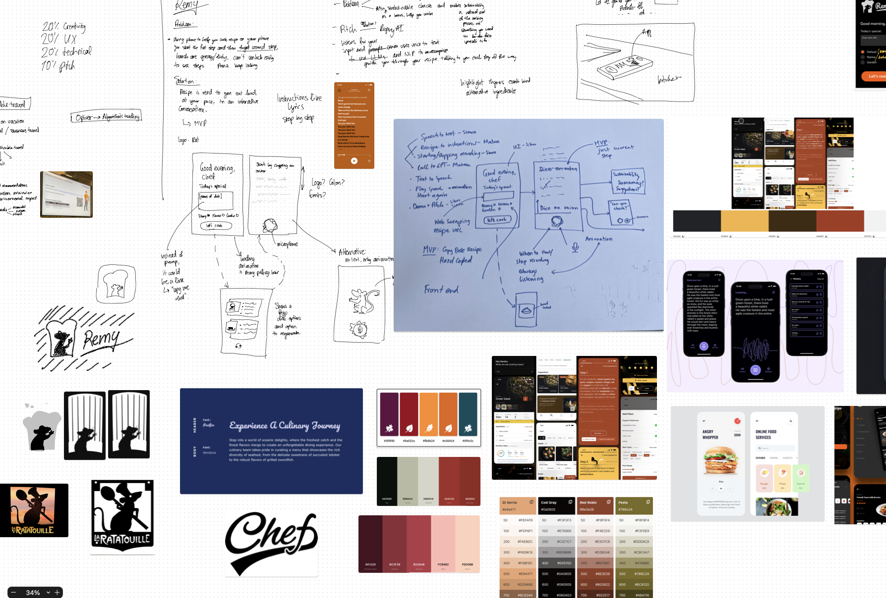
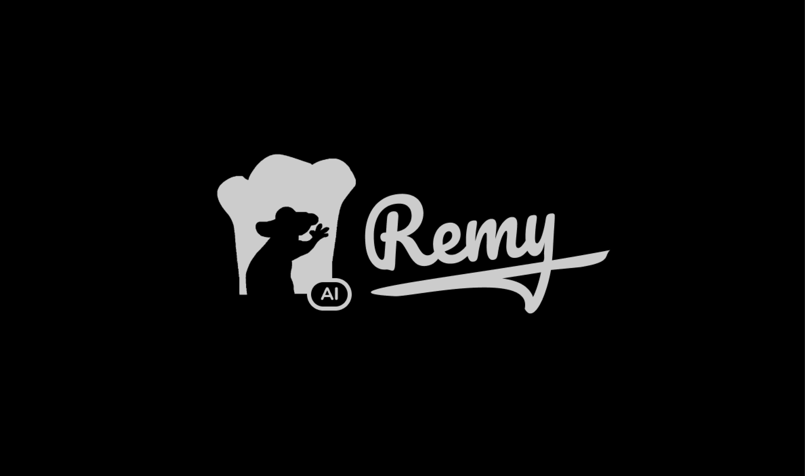
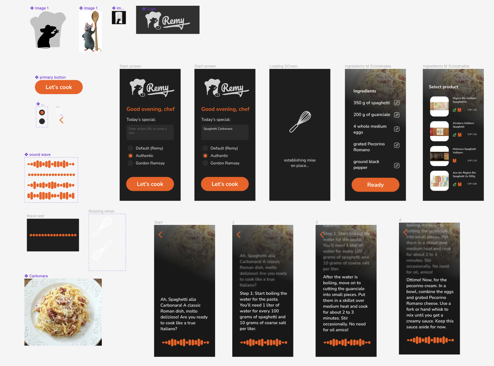

<iframe src="https://www.youtube-nocookie.com/embed/Ygs8dQEqntM" frameborder="0" allow="accelerometer; autoplay; clipboard-write; encrypted-media; gyroscope; picture-in-picture; web-share" allowfullscreen></iframe>

[Devpost: Remy | Devpost](https://devpost.com/software/remy-c2b5e1)

Participating at Europe's biggest Hackathon in Zurich with a team of experienced developers and NLP experts, we designed a voice assistant app that interactively guides the user through the cooking process and suggests sustainable ingredients, making cooking cooking effortlessly sustainable and completely hands-off.

---

## Inspiration
When building our app, we were driven by a straightforward idea: to stand out and spark interest. We drew inspiration from the small actions that lead to bigger changes, especially in sustainability. Our goal was to make a tool that doesn't just catch the eye but truly helps users step towards greener cooking habits.

---

## Branding and User Experience
As the name implies, "Remy" was named after the culinary genius rodent starring in Disney Pixar's classic, *Ratatouille*. By using Remy, the user is guided through the recipe naturally and step by step, almost as if there was a rodent tugging on their hair underneath their imaginary chef hat.

The goal of the app was to achieve a completely hands-off experience. The recipe instructions user interface was inspired by Spotify's (among others) lyrics feature, where the relevant lyrics appear on screen as soon as it's their turn. The color scheme was chosen based on warm and inviting colors commonly associated with appetite, yet dark enough to provide sufficient contrast to be read from a distance while also preserving battery.

---

## What it does
Remy is an LLM powered voice assistant for the kitchen. The user can simply tell Remy what they're cooking (per URL to an online recipe or prompt it with an idea for a dish), Remy will interactively talk the user through every step of the recipe, allowing hand-free interaction. Additionally, as the user gathers ingredients, Remy suggests sustainable alternatives, weaving sustainability effortlessly into the kitchen routine.

## How we built it
At the core, LLM powers our back-end, deftly processing recipes, extracting ingredients, and suggesting alternatives, while adeptly navigating user prompts. Voice interaction? We leaned into the Web Speech API for flawless speech-to-text conversion, and chose Eleven-Labs to breathe life into the text, translating it back to guiding voices. The facade you interact with is sculpted using React-JS, housed on Firebase. And that touch of sustainability? It’s data-driven, with a nod to real grocery product datasets.

---

## Challenges we ran into
We often lost focus, wanting to do too much at once. Combining our work was challenging. Understanding and responding to natural speech, like knowing when to listen, was hard. Setting up the app for everyone to use gave us headaches. And figuring out the best way to handle recipe prompts took a lot of time and effort. Goal setting and delivering a specific result by a certain time proved to be a challenge.

## Accomplishments that we're proud of
Seeing our first Proof-of-Concept come alive was a major win; it was proof our idea wasn't just a dream but could work in real life. We're incredibly proud of the originality of our concept. The way we divided tasks and maintained focus was spot-on. And bringing together everyone's contributions into one cohesive app is a feat we'll always cherish.
