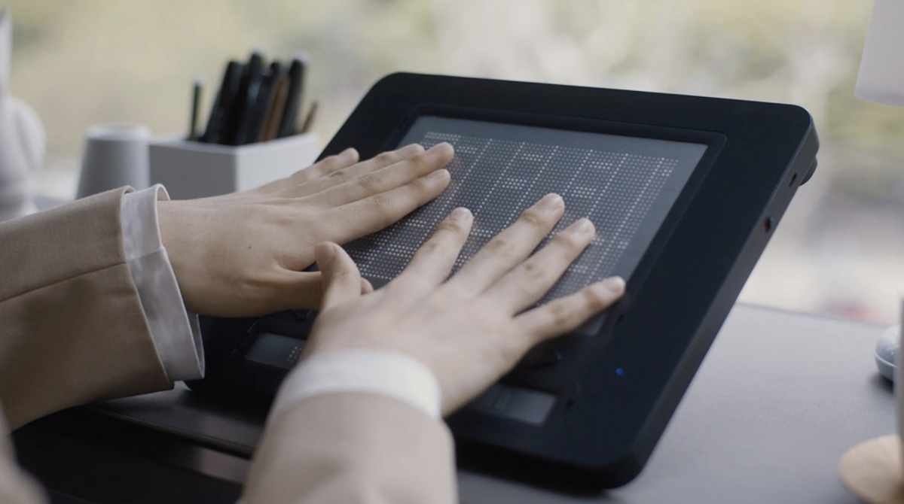
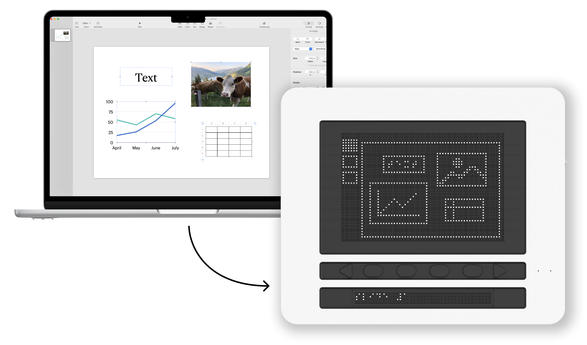
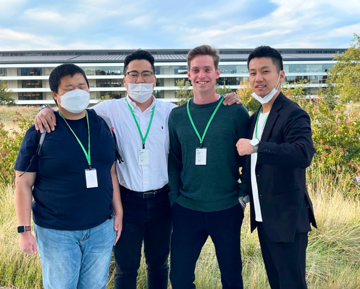
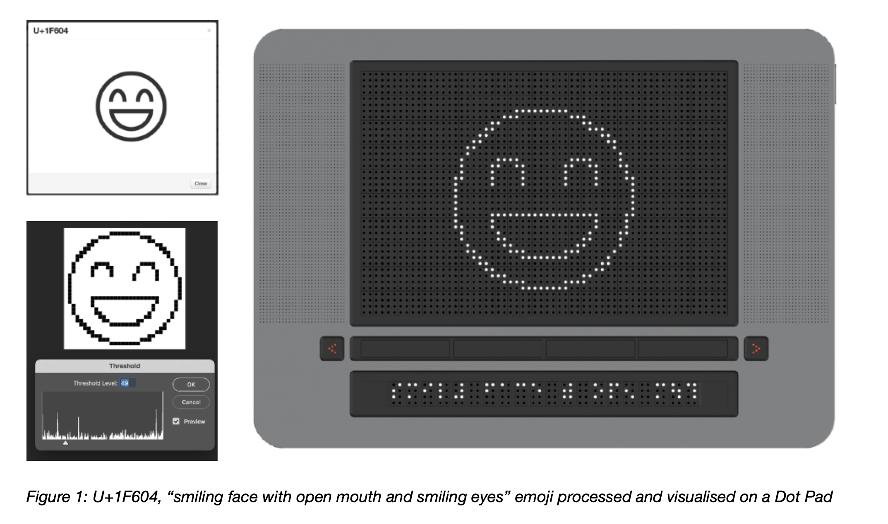

### Article
[Techcrunch article](https://techcrunch.com/2022/03/10/dot-pad-tactile-display-makes-images-touchable-for-visually-impaired-users/)

## About
Dot Incorporation is a South Korean startup producing innovative assistive technology for the blind such as braille smart watches, tactile braille displays, and accessible information kiosks.

Dot Pad is the first smart tactile graphics display for the visually impaired that enables the user to access visual content such as handwriting, graphs, equations, photos, documents, sketches and art in real time via 2400 tactile braille pins.

---

## Task
To ensure Dot's tactile displays integrate seamlessly with iOS and macOS devices, we engaged in a collaborative effort with Apple Inc.

This involved creating user experience (UX) concepts and developing an API that enables compatibility with Apple's VoiceOver, the primary assistive technology used by visually impaired users today.

### Team
A 3-day workshop was held in Cupertino with Apple's VoiceOver Team and QA testers. The team consisted of co-founders Ki Kwang Sung and Eric Ju Yoon Kim (far left, middle right), Lead Engineer Giyeon Hwang (far right), and me as the design researcher.

### Role
My role during the workshop was to create visuals and pitch decks (eg for presentation to Apple marketing team) and present my case study and findings about tactile graphics (see next page).

---

## Case Study: Displaying emojis on tactile displays
Emojis were used as a case study for how and whether images should be processed into tactile graphics.

Past studies had suggested that the ability to understand simple visual representations of facial expressions is innate in humans and not strictly learned, such that tactile emojis could indeed enhance the writing’s meaning and emotional depth.

The emoji were ordered by usage and processed into into 32x32 pixel representation. Most of these then had to be manually refined.

The design process led to questions such as:
- Which symbols provide the most value and how do we measure this?
- How do we deal with images that are too visually complex for single color 32x32 pixels?
- Is there a responsibility to convey the semantic meaning and cultural usage of an emoji or symbol, rather than their literal meaning?

