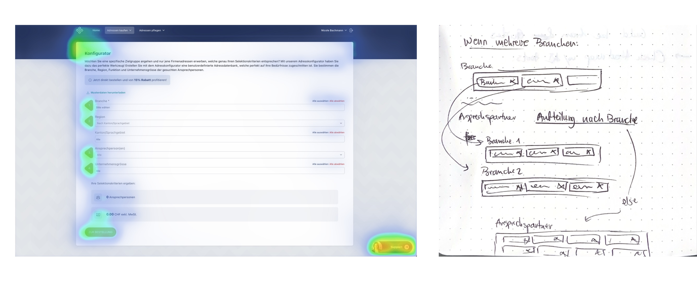
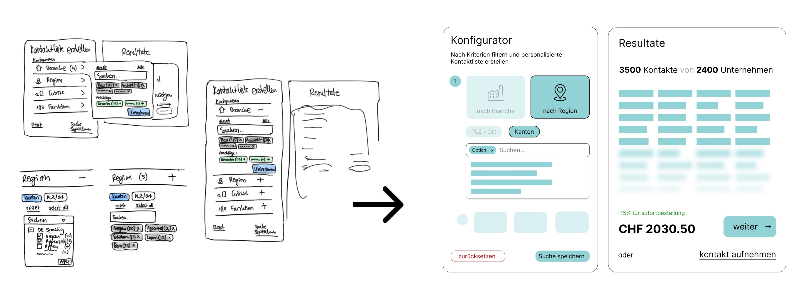
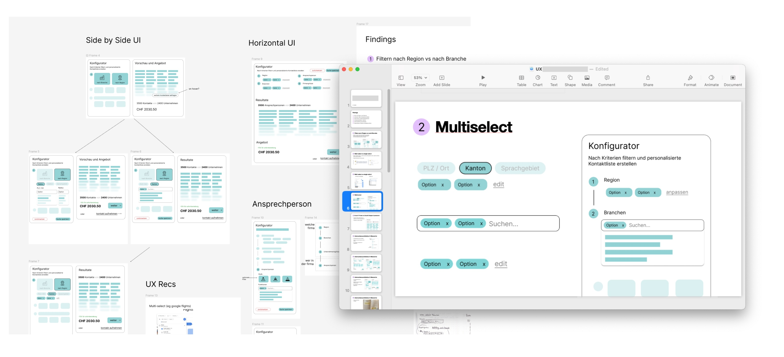
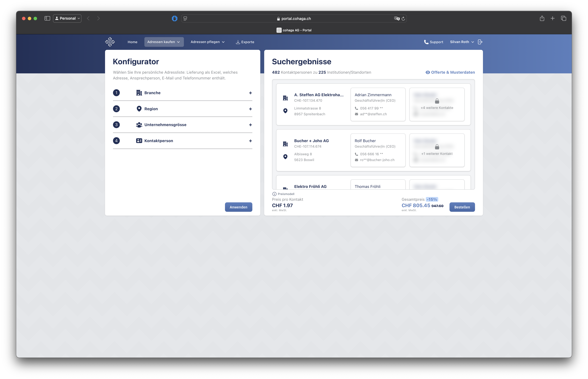

## Task
Contracted by a startup in eastern Switzerland that specializes in the creation of curated lists of contacts and sales leads. The startup lets their users select which kind of leads they are looking for using a configurator, then automatically creates a quote.

The customer felt that this experience could be improved.

## Process
We began on-site by conducting a series of user tests, some with existing users and some with new users that were unfamiliar with the product.

Based on my notes and observations from the testing session, I then dedicated a few weeks to redesigning the interface, considering things like the flow, information hierarchy, and UX writing.

## Results
We discussed the results of my research in a final presentation. The result was not a polished mockup, but rather a series of recommendations, communicated with wireframes and sketches, for how their users' experience and engagement could be improved.

## Impact
The customer has since implemented many of the changes that I recommended and their configurator has been given a significantly smoother experience. The following is a screenshot of the current UI (updated 8 Nov 2024).

