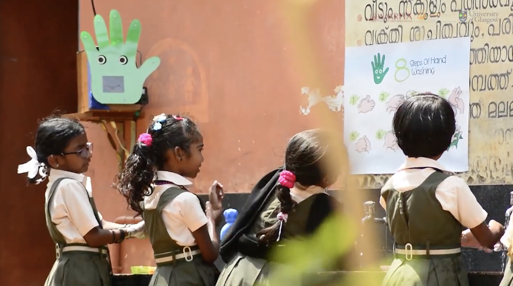
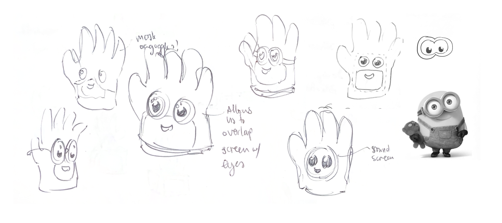
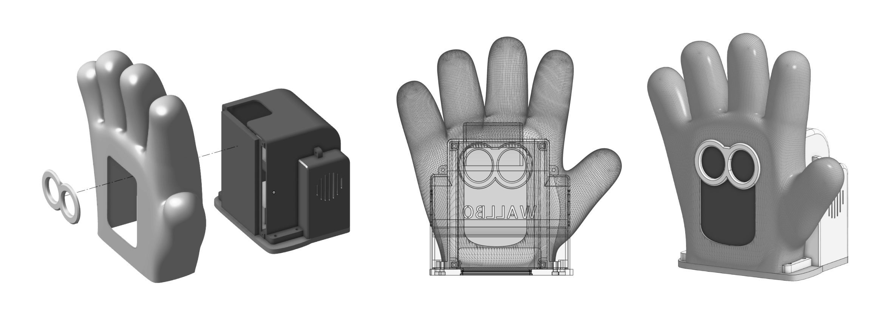
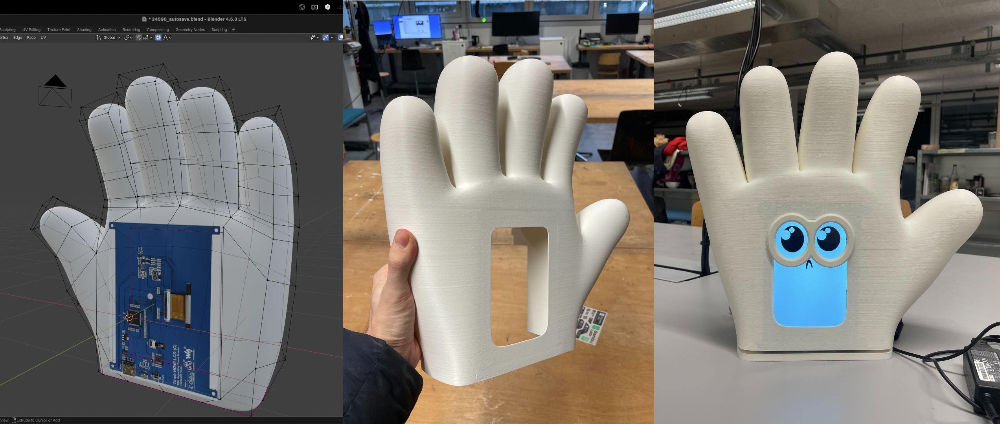
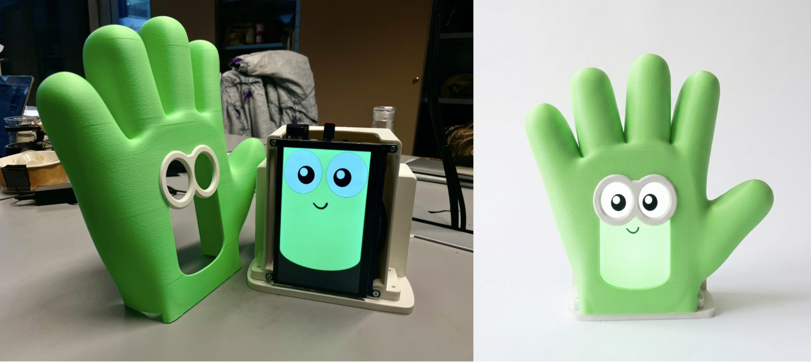

## Original Project

WallBo is a wall-mounted social robot designed to encourage and monitor handwashing habits among children in schools. Developed to combat the spread of diseases like COVID-19 and reduce child mortality rates in developing countries, the robot uses AI to engage with students, making the hygiene process fun and interactive.

## Task

The objective was to update the robot's physical design to accommodate upgraded internal hardware - specifically an Nvidia Jetson edge computer and a larger touchscreen interface. 

Additionally, the project required a visual overhaul to make the robot's appearance friendlier and more approachable for its young user base.

I was contracted to handle the Industrial Design, CAD modeling, and physical prototyping. My responsibilities focused on the complete redesign of the enclosure and the physical integration of the new electronic components.

I modeled a new enclosure that securely housed the Nvidia Jetson and touchscreen while softening the overall aesthetic to improve its "friendliness" factor.

Once the design was finalized in CAD, I 3D printed the new housing and managed the assembly process, successfully integrating the new hardware into the redesigned chassis.

