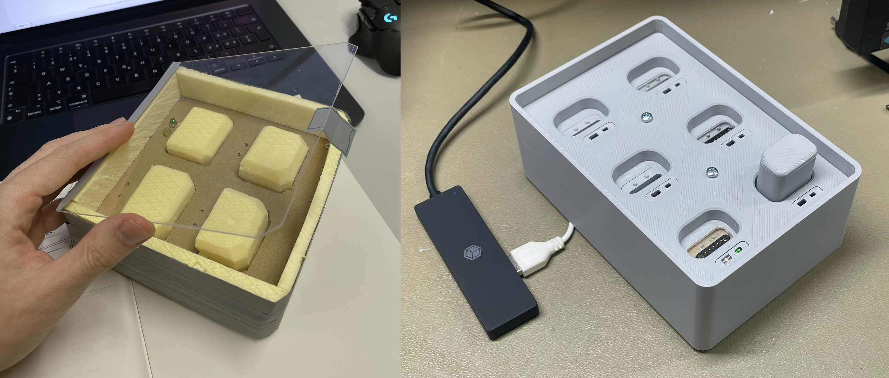
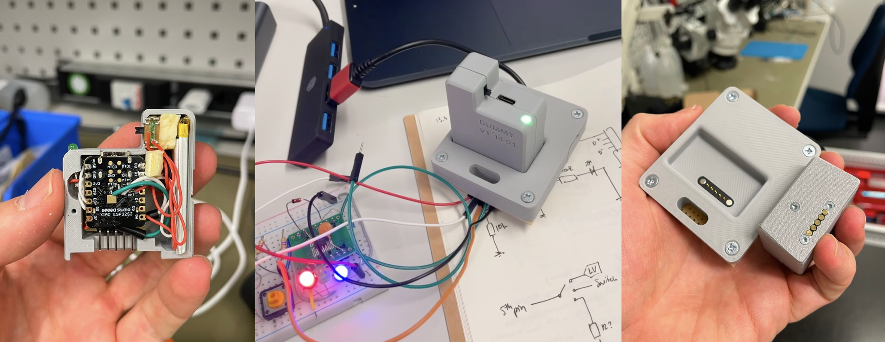
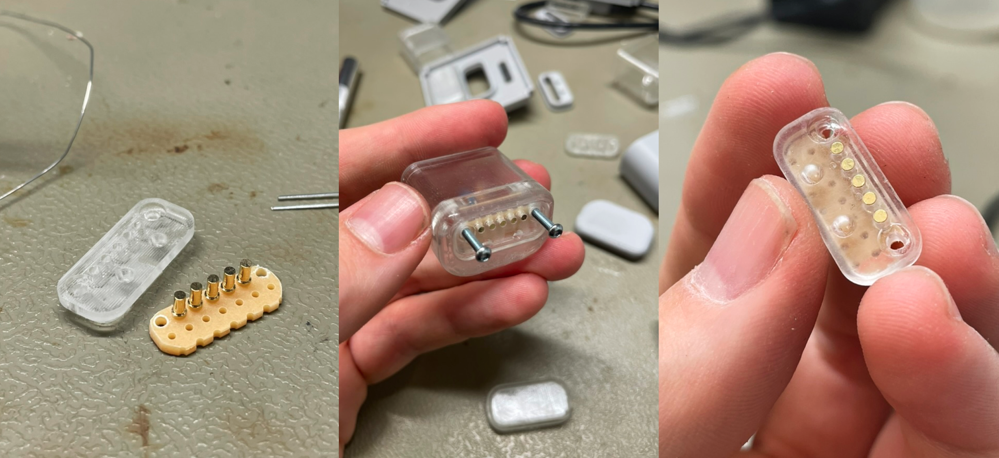
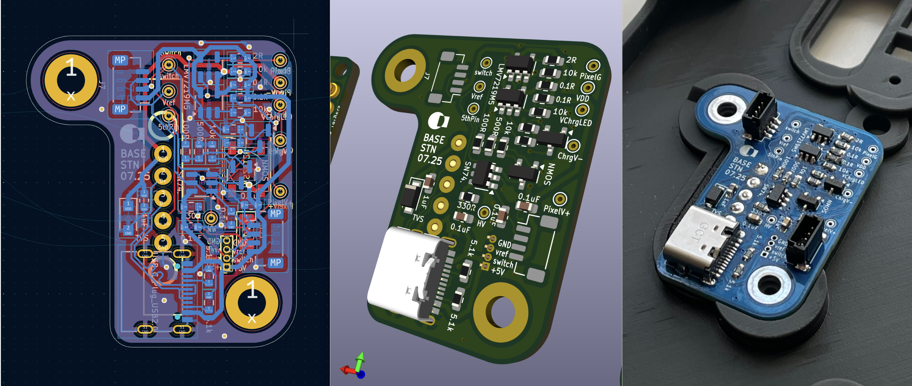
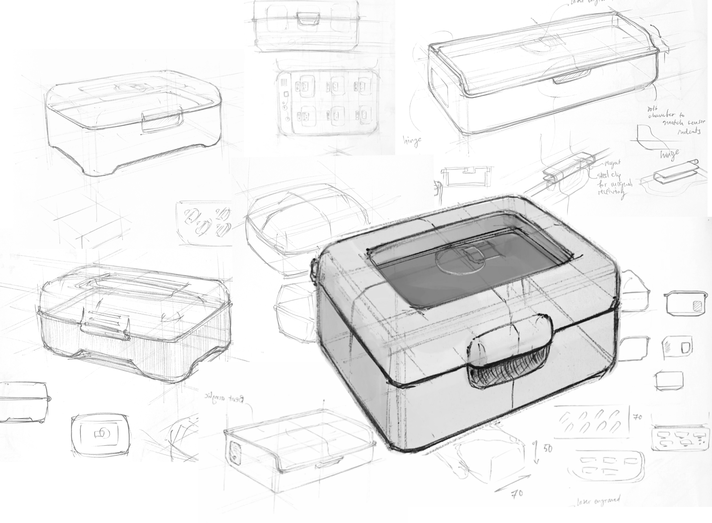
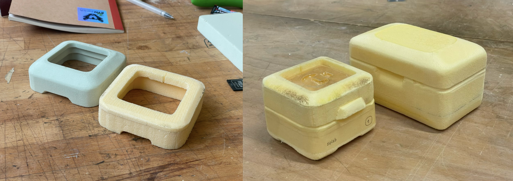
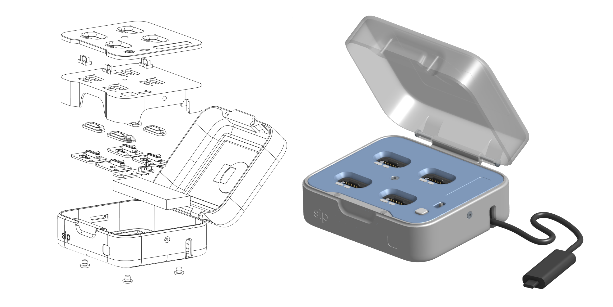
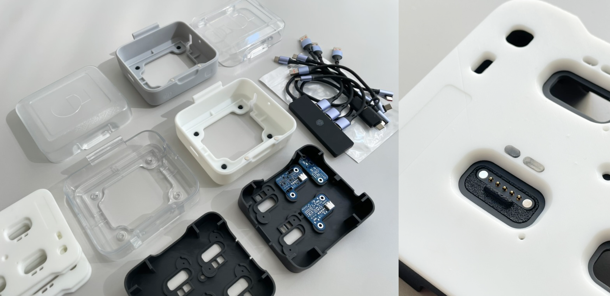

## Task
The task was to design a docking station (called the "BaseStation") to simplify the charging, data transmission, and synchronization of devices such as wearables used in data collection studies. The BaseStation was to offer flexibility and broad device compatibility while maintaining a compact footprint and ease of manufacturing and assembly. I was to design both this interface, the electronics, enclosure, integration, and a framework for making new or existing devices compatible with this device.

## Prototyping
Iterative prototyping made up the core of this project: it was crucial to get the device interface right before we continued to the enclosure, which could easily be modified later on. I began with primitive cardboard models to get a feel for the usability and then gradually moved on to more high fidelity protyping like 3D modeled parts.

## Design
A core problem of the intended docking station was that it would need to have a modular design that can be scaled to both any number of devices and any dimensions of device. The interface should be flat and as subtle as possible, it should be easy to integrate into any enclosure, but should still allow for data transmission and ideally additional inputs or outputs to interface with the docking station itself.

The solution was a 5 pin magnetic pogo pin connector: flat, corrosion resistant (suitable for situations where sweat is an issue, for instance), with a small notch for positioning and to prevent the pins from being connected in reverse.

### Electronics
Each interface needed a small PCB to handle the programmable LED and safely handle the USB to pogo pin conversion. I created a schematic and designed a PCB in KiCAD which I then ordered from JLCPB and assembled by hand.

### Enclosure
Designing the enclosure involved sketching, foam modeling, and finally 3D printing.

While visual aesthetics were not an explicit key requirement, I was determined to maintain a clean look with clear affordances, designed to be easy to manufacture and assemble, and modify later on.

### Integration
The final stage involved integrating the modular electronics into the enclosure in a way that would allow for easy assembly and disassembly, used standard fasteners and minimal or no adhesives, and involving as few custom parts as possible.

### Manufacturing
After a few iterations on small commercial 3D printers to dial in thicknesses and tolerances, I ordered the final versions through a 3D printing service (JLC3D).

### Outlook
The next stage is for the docking station to go through rigorous real world testing before being redesigned for manufacturing.

