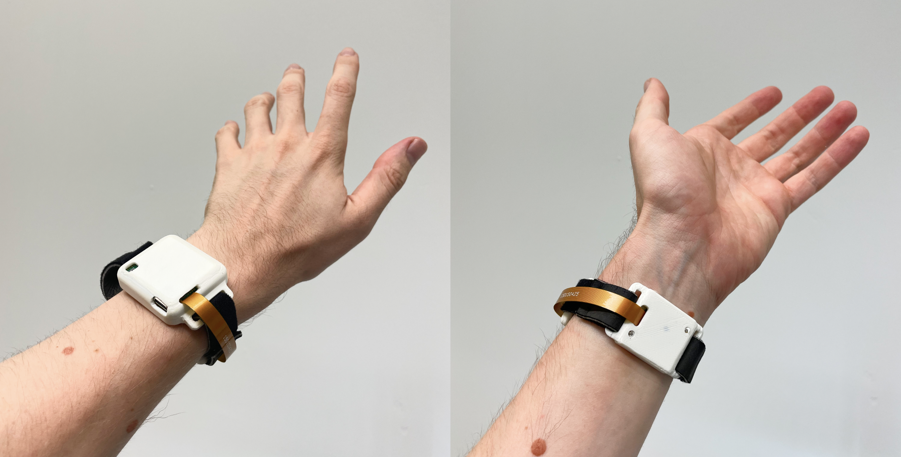
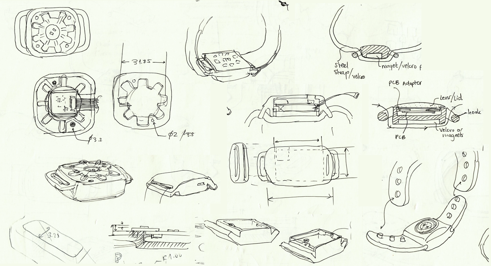
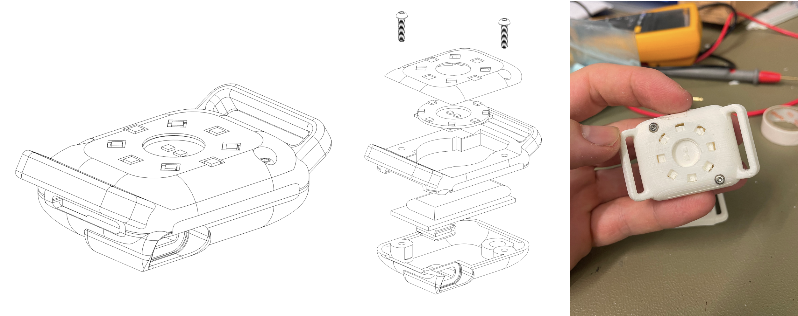
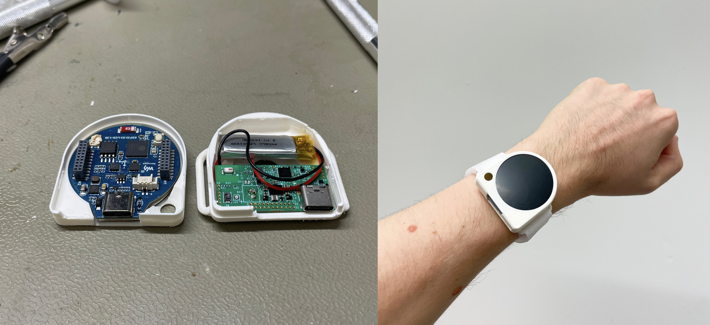

### Problem
Developed as part of a study on hand gesture sensing through photoplethysmogram (PPG) sensor data and machine learning, the challenge was to develop a series of prototypes that would allow the lab to perform the user studies.

### First tests
PPG is a technique commonly used for pulse measurement in smart watches. The original idea was to modify existing PPG sensing development boards, enlarging their light sensor rings and repositioning the sensors from the volar (bottom) wrist to the dorsal (top) wrist.

Designs were created in KiCad and Autodesk Fusion, 3D printed in PLA on an Ultimaker 4.

### Second iteration
The second iteration aimed to be as compact as possible, packaging all components into one module, rather than having a dorsal and a volar element connected by fragile flat band cables.

### Later versions
A later version required an IMU sensor and a touch screen, both which we found in an ESP32 smart watch development board. The tradeoff was a much larger enclosure and a dual USB-C port.

