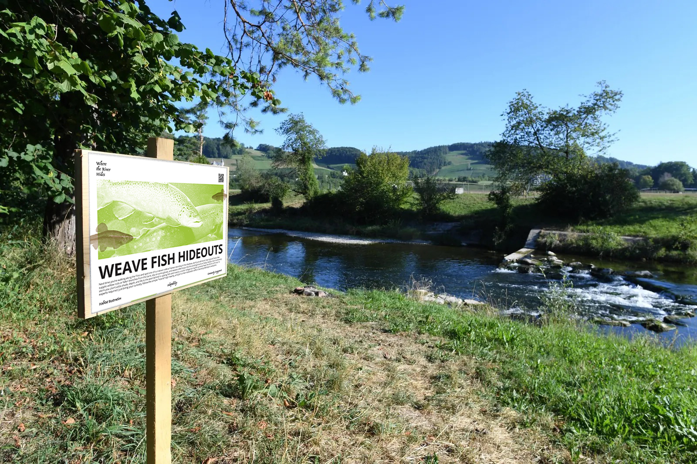
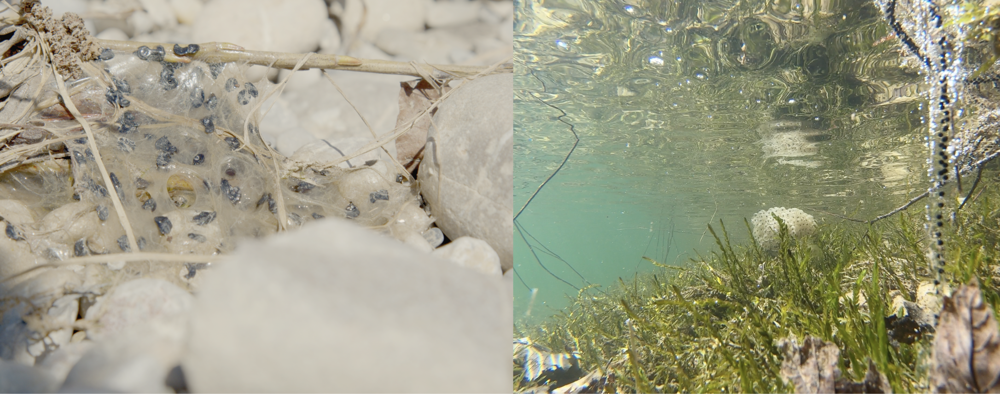
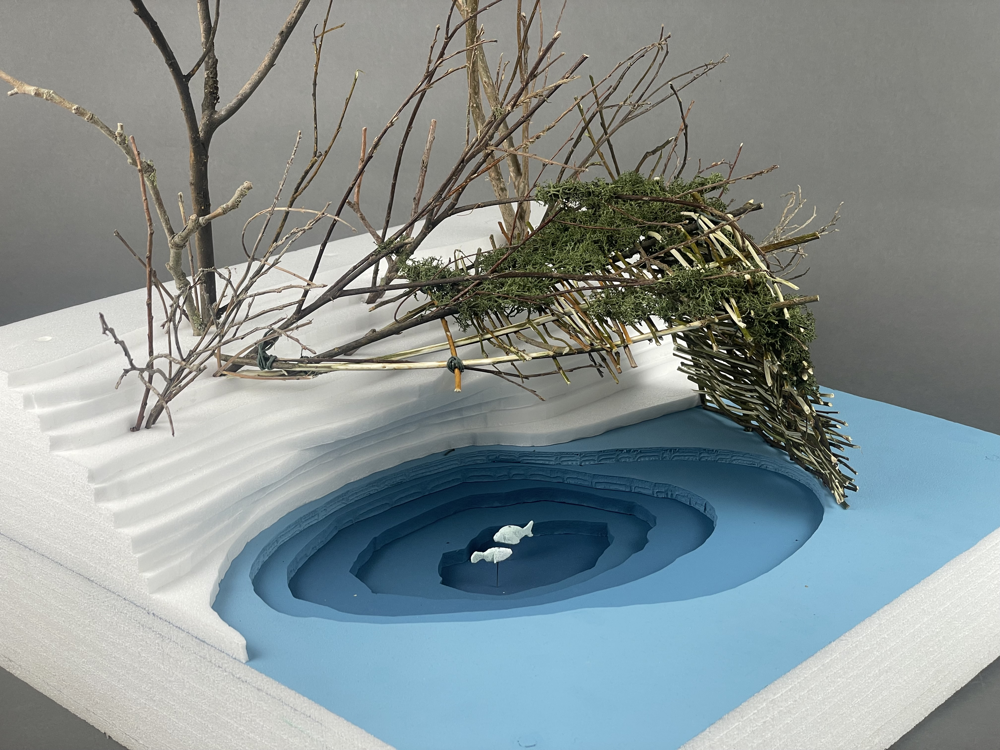
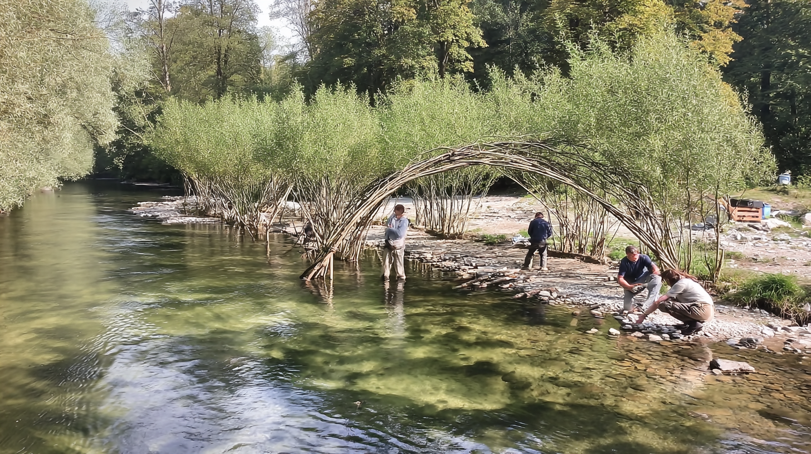
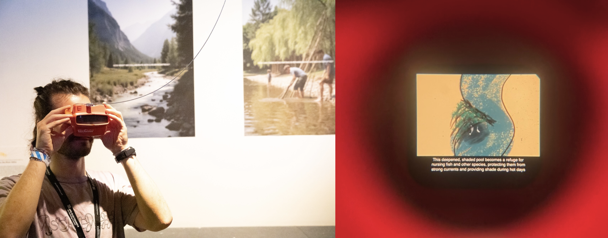

Ars Electronica Page: [Where the River Hides](https://ars.electronica.art/panic/de/view/where-the-river-hides-21e38ddb450c81ef9d1ae97eb74e55b7/)

“Where the River Hides” is an interdisciplinary research project that brings together knowledge from diverse fields and engages communities to contribute to river revitalization efforts. The exploration took place along the Töss River in eastern Switzerland, where aquatic natives such as the brown trout and minnow are increasingly threatened by heatwaves that devastate their populations.

Our aim was not only to explore technical solutions to these challenges but also to find sustainable ways to engage both local communities and visitors in making small but cumulative contributions to river revitalization.

## Working with Ecological Interconnectivity
Rivers are habitats, breeding grounds, and migration corridors– veins that connect ecosystems. Their ecological interdependence presents challenges for urban planning and conservation. Climate change and human intervention amplify issues like overheating, drought, and flash floods, making it clear that solutions must work with, not against, natural systems.

### Designing Interventions
Drawing from environmental engineering and ecology, we found that the most effective solutions are often surprisingly simple: offering aquatic species hideouts, shade, and a steady flow of fresh water. Civil engineering introduced us to flow deflections: techniques that use fluid dynamics to subtly reshape the river’s course and improve habitats along the riverbed and undercut banks. Local fishing associations have long applied this knowledge in small- to medium-scale interventions, while community-led flood protection efforts use woven willow branches to reinforce riverbanks.

Our proposal combines these approaches: a woven willow obstacle that redirects the river’s flow, deepens the riverbed, and erodes part of the bank to form a shaded refuge pool. Vegetation helps stabilize the structure, provides natural shade, and integrate it into the ecosystem.

### A Vision of Community-Led Revitalization
Planned river restoration is slow, costly, and politically complex. But we believe healthy ecosystems shouldn’t depend entirely on urban planning budgets. While large-scale projects appeal through promises of recreation, we see value in engaging people directly.

Our structures are designed to be built gradually, with no technical skill required, yet robust enough to let the river and vegetation take over. This approach offers locals and visitors a tangible, meaningful way to interact with and care for nature.

## Ars Electronica 2025
We exhibited this project at the 2025 Ars Electronica festival under the theme "Not Plan B", an exhibition on ecological interactions. Instead of focusing on the technical implementation of the intervention, we emphasized the playful and low-tech nature of the idea by printing an explanation onto analog slides, viewable through a View-Master from the 1980s.

